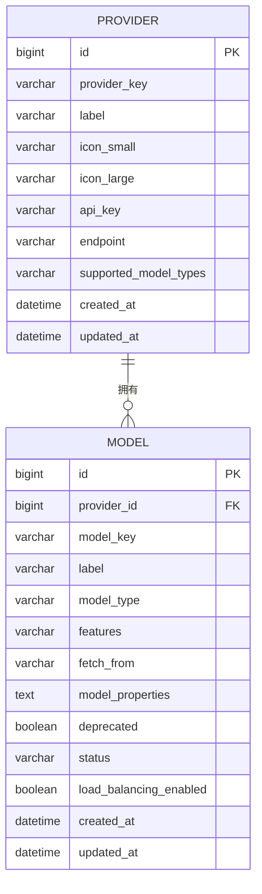

# 模型提供商与模型实例表结构设计（Dify 风格）

## 1. 设计目标
本设计用于支撑类似 Dify 的模型管理模块，涵盖模型提供商（Provider）与模型实例（Model）的核心表结构。该设计不考虑多租户与多语言场景，聚焦于单一环境下的通用能力。

---

## 2. 功能需求
1. **模型提供商管理**
   - 新增、编辑、删除模型提供商（Provider），配置全局 API Key、Endpoint、支持模型类型、图标等。
   - 查询所有模型提供商及其元数据。
2. **模型实例管理**
   - 新增、编辑、删除模型实例（Model），配置类型、能力标签、上下文参数、状态等。
   - 查询所有模型实例，支持按 Provider 分组。
   - 启用/禁用模型实例（不影响 Provider 下其他模型）。
3. **能力与属性管理**
   - 支持模型能力标签（如 tool-call、agent-thought 等）灵活扩展。
   - 支持模型属性（如 context_size、mode 等）以 JSON 形式存储。
4. **调用与安全**
   - 推理/调用时，自动按模型实例找到 Provider 并读取 API Key。
   - Provider 的 API Key 变更后，影响其下所有模型实例的调用。
5. **状态与废弃管理**
   - 支持模型实例的启用、禁用、废弃（deprecated）等状态管理。

---

## 3. 主要实体与关系
- **模型提供商（Provider）**：如 deepseek、通义千问等，拥有全局 API Key、支持的模型类型、图标等元数据。
- **模型实例（Model）**：如 deepseek-reasoner，属于某个 Provider，拥有类型、能力、上下文参数、状态等。
- **关系**：一个 Provider 可拥有多个 Model，Model 通过 provider_id 关联 Provider。

---

## 4. ER 关系图


---

## 5. 字段说明
### provider（模型提供商表）
| 字段名                | 类型           | 说明                   |
|----------------------|---------------|------------------------|
| id                   | bigint/pk     | 主键                   |
| provider_key         | varchar(128)  | 唯一标识（如 deepseek）|
| label                | varchar(128)  | 名称                   |
| icon_small           | varchar(256)  | 小图标URL              |
| icon_large           | varchar(256)  | 大图标URL              |
| api_key              | varchar(256)  | API Key（全局）        |
| endpoint             | varchar(256)  | API Endpoint           |
| supported_model_types| varchar(128)  | 支持的模型类型（逗号分隔）|
| created_at           | datetime      | 创建时间               |
| updated_at           | datetime      | 更新时间               |

### model（模型实例表）
| 字段名                | 类型           | 说明                   |
|----------------------|---------------|------------------------|
| id                   | bigint/pk     | 主键                   |
| provider_id          | bigint/fk     | 关联provider.id        |
| model_key            | varchar(128)  | 模型唯一标识           |
| label                | varchar(128)  | 名称                   |
| model_type           | varchar(64)   | 模型类型（llm/tts等）  |
| features             | varchar(256)  | 能力标签（逗号分隔）   |
| fetch_from           | varchar(64)   | 来源（如predefined-model）|
| model_properties     | text          | 其他属性（如context_size, mode等，JSON格式）|
| deprecated           | boolean       | 是否废弃               |
| status               | varchar(32)   | 状态（active/inactive）|
| load_balancing_enabled| boolean      | 是否负载均衡           |
| created_at           | datetime      | 创建时间               |
| updated_at           | datetime      | 更新时间               |

---

## 6. 典型建表 SQL 示例

```sql
-- 模型提供商表
CREATE TABLE provider (
    id BIGINT PRIMARY KEY AUTO_INCREMENT,
    provider_key VARCHAR(128) NOT NULL UNIQUE,
    label VARCHAR(128) NOT NULL,
    icon_small VARCHAR(256),
    icon_large VARCHAR(256),
    api_key VARCHAR(256) NOT NULL,
    endpoint VARCHAR(256),
    supported_model_types VARCHAR(128),
    created_at DATETIME DEFAULT CURRENT_TIMESTAMP,
    updated_at DATETIME DEFAULT CURRENT_TIMESTAMP ON UPDATE CURRENT_TIMESTAMP
);

-- 模型实例表
CREATE TABLE model (
    id BIGINT PRIMARY KEY AUTO_INCREMENT,
    provider_id BIGINT NOT NULL,
    model_key VARCHAR(128) NOT NULL,
    label VARCHAR(128) NOT NULL,
    model_type VARCHAR(64) NOT NULL,
    features VARCHAR(256),
    fetch_from VARCHAR(64),
    model_properties TEXT,
    deprecated BOOLEAN DEFAULT FALSE,
    status VARCHAR(32) DEFAULT 'active',
    load_balancing_enabled BOOLEAN DEFAULT FALSE,
    created_at DATETIME DEFAULT CURRENT_TIMESTAMP,
    updated_at DATETIME DEFAULT CURRENT_TIMESTAMP ON UPDATE CURRENT_TIMESTAMP,
    CONSTRAINT fk_provider_id FOREIGN KEY (provider_id) REFERENCES provider(id)
);
```

---

## 7. 后端接口设计（RESTful API）

### Provider（模型提供商）相关接口
- `GET /providers`         ：查询所有模型提供商及其元数据
- `POST /providers`        ：新增模型提供商
- `PUT /providers/{id}`    ：编辑模型提供商
- `DELETE /providers/{id}` ：删除模型提供商

### Model（模型实例）相关接口
- `GET /models`            ：查询所有模型实例（可按 provider_id 过滤）
- `POST /models`           ：新增模型实例
- `PUT /models/{id}`       ：编辑模型实例
- `DELETE /models/{id}`    ：删除模型实例
- `PATCH /models/{id}/enable`  ：启用/禁用模型实例

### 典型DTO示例
```json
// ProviderDTO
{
  "id": 1,
  "provider_key": "deepseek",
  "label": "DeepSeek",
  "icon_small": "url",
  "icon_large": "url",
  "api_key": "xxxx",
  "endpoint": "https://api.xxx.com",
  "supported_model_types": "llm,tts",
  "created_at": "2024-07-01T12:00:00Z",
  "updated_at": "2024-07-01T12:00:00Z"
}

// ModelDTO
{
  "id": 1,
  "provider_id": 1,
  "model_key": "deepseek-reasoner",
  "label": "deepseek-reasoner",
  "model_type": "llm",
  "features": "tool-call,agent-thought",
  "fetch_from": "predefined-model",
  "model_properties": "{\"context_size\":128000,\"mode\":\"chat\"}",
  "deprecated": false,
  "status": "active",
  "load_balancing_enabled": false,
  "created_at": "2024-07-01T12:00:00Z",
  "updated_at": "2024-07-01T12:00:00Z"
}
```

---

## 8. 核心枚举定义

### ModelType（模型类型）
- LLM
- TTS
- TEXT_EMBEDDING
- RERANK
- SPEECH2TEXT

### ModelStatus（模型状态）
- active
- inactive
- disabled

### Feature（能力标签，常见值）
- tool-call
- agent-thought
- multi-tool-call
- stream-tool-call

### FetchFrom（模型来源）
- predefined-model
- custom-model

---

## 9. 设计说明
- **多语言与多租户**：本设计未考虑，如需支持可扩展 label、api_key、tenant_id 等字段为 JSON 或增加相关表。
- **灵活字段**：features、supported_model_types、model_properties 建议用逗号分隔或 JSON 存储，便于扩展。
- **状态管理**：通过 status、deprecated、load_balancing_enabled 字段灵活控制。
- **一对多关系**：provider 与 model 通过 provider_id 外键关联。 