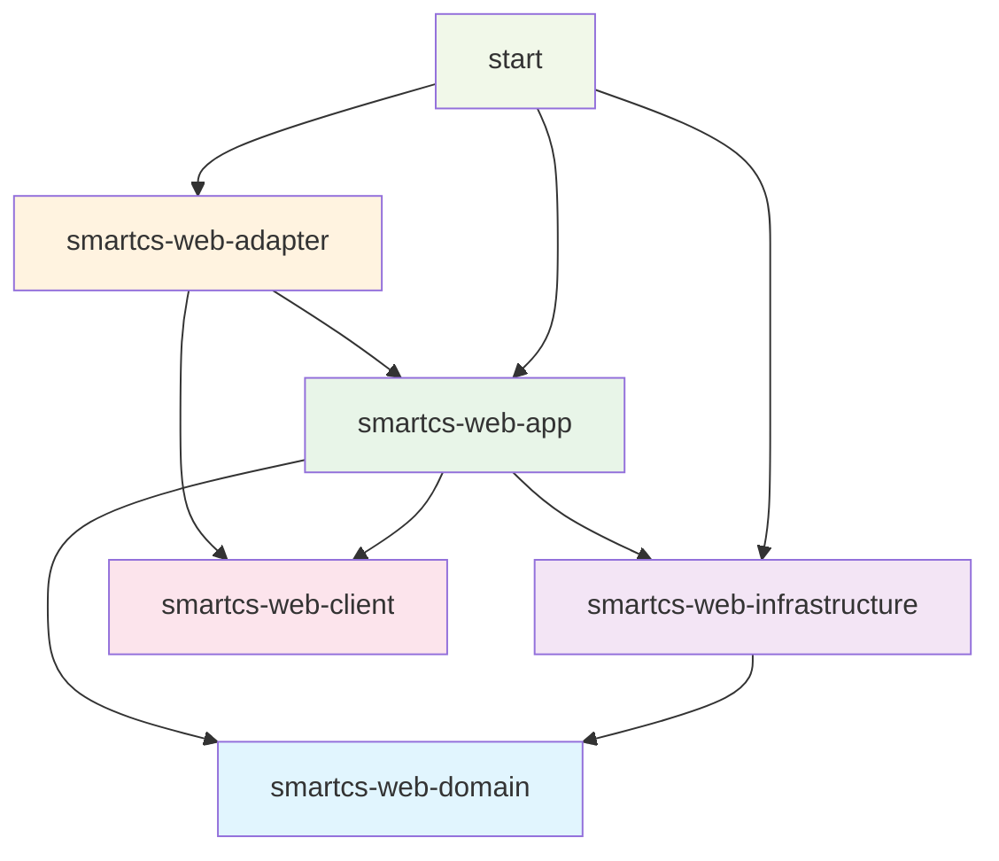
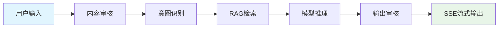
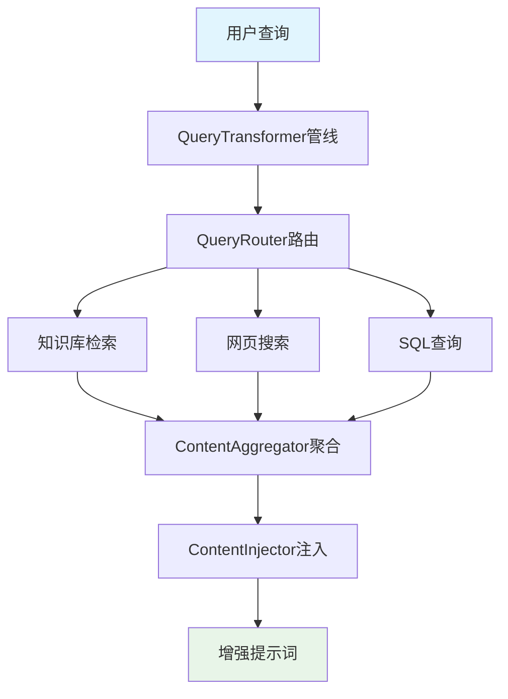
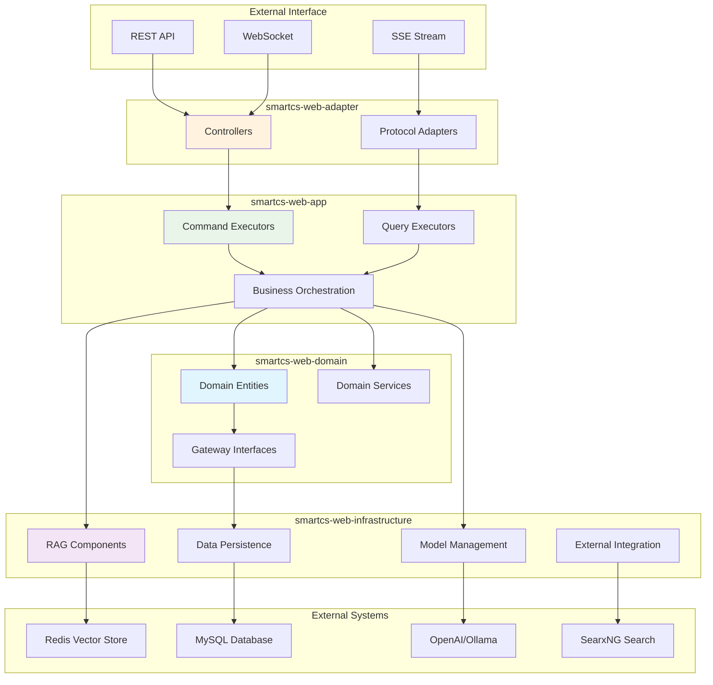
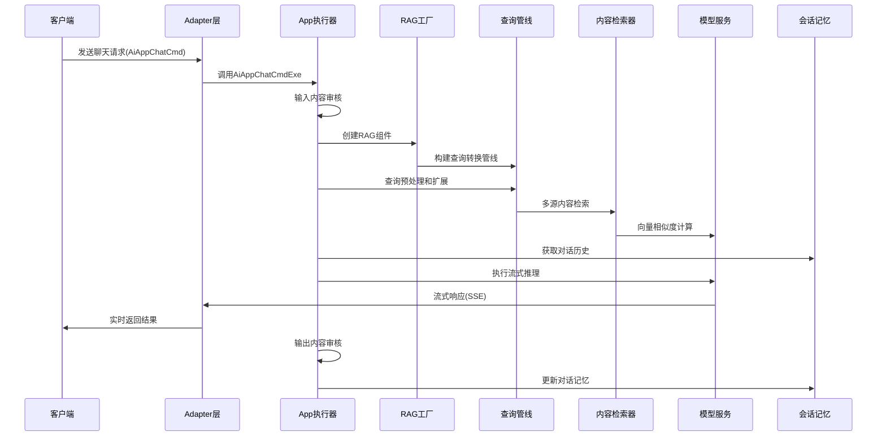

<div align="center">

# SmartCS Web（智能客服与RAG平台）

基于 Spring Boot + COLA 分层 + LangChain4j 的企业级智能客服与检索增强生成（RAG）平台。

</div>

---

## 平台概述

SmartCS Web是一个全功能的企业级智能客服平台，通过AI技术为用户提供智能对话、知识检索、意图识别等核心能力。平台采用业务模块化设计，支持多种AI模型提供商，具备完整的知识库管理、实时聊天、检索增强生成（RAG）等功能。

### 核心特性
- **AI驱动**: 基于LangChain4j 1.1.0框架，支持多种大语言模型
- **模块化设计**: 清晰的业务模块划分，易于理解和维护
- **企业级架构**: 采用DDD + COLA架构，支持高并发和高可用
- **实时通信**: 支持WebSocket、SSE流式响应
- **知识增强**: 完整的RAG检索增强生成能力
- **多模态支持**: 支持文本、图像等多种输入格式

## 业务功能模块

SmartCS Web平台以业务领域为核心组织功能模块，每个模块提供完整的业务能力：

### 🤖 [AI应用模块](docs/业务模块-AI应用模块.md)
**核心职责**: AI应用的全生命周期管理，提供智能对话能力
- **主要功能**: 应用创建、配置管理、流式对话、Prompt优化
- **关键特性**: 基于LangChain4j的流式响应、SSE实时推送、多轮对话
- **应用场景**: 智能客服机器人、AI助手、专业咨询工具

### 💬 [智能聊天模块](docs/业务模块-智能聊天模块.md)
**核心职责**: 提供完整的对话服务能力，管理会话生命周期
- **主要功能**: 会话管理、消息处理、实时通信、状态流转
- **关键特性**: WebSocket全双工通信、水平分表存储、Spring State Machine状态管理
- **应用场景**: 实时客服对话、多轮会话管理、智能会话分配

### 📚 [知识库管理模块](docs/业务模块-知识库管理模块.md)  
**核心职责**: 知识的采集、处理、存储、检索和管理
- **主要功能**: 文档解析、智能分块、向量化存储、语义检索
- **关键特性**: 多格式文档支持、Redis Vector存储、召回测试
- **应用场景**: 企业知识管理、智能问答、文档检索

### 🎯 [意图识别模块](docs/业务模块-意图识别模块.md)
**核心职责**: 分析用户输入文本，识别用户意图和业务场景
- **主要功能**: 实时分类、批量处理、运行时配置、困难样本管理
- **关键特性**: 多渠道支持、意图快照、A/B测试、增量学习
- **应用场景**: 智能客服路由、对话意图分析、业务流程自动化

### ⚙️ [AI模型管理模块](docs/业务模块-AI模型管理模块.md)
**核心职责**: AI大语言模型的配置、管理、调用和监控
- **主要功能**: 多提供商支持、模型配置、统一调用、性能监控
- **关键特性**: OpenAI/Ollama支持、负载均衡、熔断重试、调用统计
- **应用场景**: 模型资源管理、成本控制、性能优化

### 🔍 [RAG检索增强模块](docs/业务模块-RAG检索增强模块.md)
**核心职责**: 将外部知识库与大语言模型结合，提供检索增强生成能力
- **主要功能**: 查询转换、多策略检索、结果融合、上下文管理  
- **关键特性**: 意图感知检索、混合检索策略、对话记忆、个性化推荐
- **应用场景**: 智能问答增强、知识助手、专业咨询系统

## 技术架构分层

平台采用DDD + COLA分层架构，严格按层次职责分离：

### 🌐 Adapter（适配器层）
**职责**: 外部接口适配和协议转换
- REST API、WebSocket、SSE等协议适配
- 请求响应格式转换和参数验证

### 🚀 App（应用服务层） 
**职责**: 业务用例编排和流程控制
- 命令查询执行器（CmdExe/QryExe）
- 跨模块业务协调和事务管理

### 🏛️ Domain（领域核心层）
**职责**: 核心业务领域模型和规则
- 业务实体和聚合根定义
- 领域服务和业务规则实现

### 🏗️ Infrastructure（基础设施层）
**职责**: 技术实现和外部系统集成
- 数据持久化、缓存、消息队列
- 外部API集成和技术组件封装

### 📋 Client（契约层）
**职责**: 定义外部API契约
- DTO定义、接口契约、参数验证

## 架构依赖流向



## 关键能力与组件

### 🤖 智能聊天服务（多模态RAG）
基于LangChain4j框架的企业级聊天服务，支持实时流式响应和多模态输入



- **核心组件：** `AiAppChatCmdExe` + `SmartChatService`
- **流式推理：** 基于`StreamingChatModel`的实时响应，支持SSE和WebSocket
- **多模态支持：** 图片+文本混合输入，智能理解多媒体内容
- **记忆管理：** `MessageWindowChatMemory`维持对话上下文
- **安全保障：** 输入/输出双重内容审核，确保合规安全
- **动态配置：** 支持前端传入`RagComponentConfig`实时调整RAG参数

### 🔍 RAG组件工厂与智能检索
完整的检索增强生成（RAG）解决方案，支持多源检索和智能路由



**🏭 RagAugmentorFactory（组件工厂）**
- **职责：** 动态装配`RetrievalAugmentor`，支持配置驱动的组件组合
- **组件缓存：** 避免重复创建，提升性能
- **配置验证：** 自动验证和修正配置参数

**🔄 QueryTransformerPipeline（查询转换管线）**
- **管线阶段：** 标准化 → 语义对齐 → 意图抽取 → 槽位填充 → 前缀补全 → 同义召回 → 可检索化改写 → 扩展策略
- **意图集成：** 内置意图识别和槽位填充，支持复杂对话流程
- **性能监控：** 阶段耗时、Token消耗、成本统计
- **降级策略：** 支持超时和异常情况下的优雅降级

**🗂️ QueryRouter（查询路由）**
- **知识库检索：** `EmbeddingStoreContentRetriever` + Redis向量存储
- **网页搜索：** `WebSearchContentRetriever` + SearxNG引擎
- **SQL查询：** `SqlQueryContentRetriever` + NL2SQL转换

**📊 ContentAggregator（内容聚合）**
- **重排序：** 支持`ScoringModel`对检索结果重新排序
- **智能筛选：** 基于相关性和质量分数的内容过滤
- **降级支持：** 评分模型不可用时自动回退到基础聚合器

### 🎯 模型管理与安全
企业级模型管理系统，支持多提供商和动态配置

**🔧 DynamicModelManager（动态模型管理器）**
- **多模型支持：** Chat/Streaming/Embedding/Scoring模型统一管理
- **提供商适配：** OpenAI、Ollama、自定义提供商无缝集成
- **模型缓存：** 智能缓存策略，减少模型加载时间
- **故障转移：** 主备模型自动切换，保证服务可用性

**🔐 SecretCryptoService（密钥加密服务）**
- **加密算法：** AES-GCM加密，支持密钥轮换
- **即时解密：** 运行时动态解密API Key，避免明文存储
- **模板配置：** `application-secrets-template.yaml`配置模板
- **合规保障：** 满足企业级安全和合规要求

### 📚 知识库与向量存储
基于Redis的高性能向量存储和知识管理系统

**🗄️ Redis向量存储**
- **技术栈：** LangChain4j社区版Redis Starter
- **向量索引：** 支持高维向量的快速相似性搜索
- **分块策略：** 多种文档分块策略，优化检索效果
- **元数据管理：** 丰富的元数据支持，精确过滤和排序

**📖 知识管理**
- **文档解析：** 支持PDF、Word、文本等多种格式
- **FAQ管理：** 结构化问答对管理和检索
- **内容审核：** 知识内容的质量评估和合规检查
- **召回测试：** 检索质量评估和调优工具

### 🔧 意图识别与槽位填充
智能对话理解，支持复杂业务场景的意图处理

**🎯 意图识别系统**
- **分类模型：** 基于LangChain4j的意图分类服务
- **多轮对话：** 支持复杂多轮对话的意图跟踪
- **意图路由：** 基于意图的智能业务路由
- **配置管理：** 可视化意图配置和规则管理

**🔗 槽位填充**
- **实体抽取：** 从用户输入中提取结构化信息
- **澄清机制：** 自动识别缺失信息并主动询问
- **验证逻辑：** 槽位值的格式和业务规则验证
- **状态管理：** 会话级槽位状态持久化

### 📊 可观测性与弹性
全链路监控和故障恢复机制，保障生产级服务质量

**📈 可观测性**
- **指标监控：** Micrometer + Prometheus指标采集
- **链路追踪：** OpenTelemetry分布式追踪
- **健康检查：** Spring Actuator健康状态监控
- **日志聚合：** 结构化日志和错误追踪

**🛡️ 弹性设计**
- **熔断器：** Resilience4j熔断保护，防止级联故障
- **限流控制：** 请求限流和资源保护
- **重试机制：** 智能重试策略，提高成功率
- **舱壁隔离：** 资源隔离，避免单点故障影响全局

## 目录导航（精选）

- 应用启动：`start/src/main/java/com/leyue/smartcs/Application.java:15`
- 运行配置：`start/src/main/resources/application.yaml:1`
- 分库分表配置：`start/src/main/resources/application-sharding.yaml:1`
- 密钥模板：`start/src/main/resources/application-secrets-template.yaml:1`
- RAG 工厂：`smartcs-web-infrastructure/src/main/java/com/leyue/smartcs/rag/factory/RagAugmentorFactory.java:1`
- 查询管线：`smartcs-web-infrastructure/src/main/java/com/leyue/smartcs/rag/query/pipeline/QueryTransformerPipeline.java:1`
- 查询管线配置：`smartcs-web-infrastructure/src/main/java/com/leyue/smartcs/rag/config/QueryTransformerConfiguration.java:1`
- 嵌入存储：`smartcs-web-infrastructure/src/main/java/com/leyue/smartcs/rag/config/RedisEmbeddingStoreConfig.java:1`
- 模型提供者：`smartcs-web-infrastructure/src/main/java/com/leyue/smartcs/model/gateway/ModelProvider.java:1`
- 模型管理器：`smartcs-web-infrastructure/src/main/java/com/leyue/smartcs/model/ai/DynamicModelManager.java:1`
- 聊天执行器：`smartcs-web-app/src/main/java/com/leyue/smartcs/app/executor/AiAppChatCmdExe.java:1`
- 公开聊天 API：`smartcs-web-adapter/src/main/java/com/leyue/smartcs/web/app/PublicAiAppController.java:1`

## 架构流转与数据流

### 整体架构流向


### RAG处理流程详解


## 构建与运行

- 构建（跳过测试）：`mvn clean install -DskipTests`
- 快速编译：`mvn -q -DskipTests compile`
- 运行全部测试：`mvn test`
- 运行单模块测试：`mvn -pl smartcs-web-infrastructure test`
- 运行单测类：`mvn -Dtest=EmbeddingModelTest test`
- 本地启动：
  - `cd start && mvn spring-boot:run`

依赖环境（按需）

- JDK 17、Maven 3.8+
- Redis（向量存储/缓存）
- MySQL（模型/提供商/知识库/意图等表；数据源需通过外部配置注入）
- 可选：Kafka（评估采样）、Nacos（配置/注册）、SearxNG（Web 搜索）、OpenTelemetry Collector

环境变量（示例，可按实际提供商/代理调整）

```bash
export OPENAI_API_KEY=...
export OPENAI_BASE_URL=https://api.openai.com/v1   # 或企业代理/自托管兼容端点

# 如使用外部 secrets 配置文件
# java -jar app.jar --spring.config.additional-location=classpath:secrets.yaml
```

数据源与中间件

- 数据源请通过外部配置提供（示例）：
  - `SPRING_DATASOURCE_URL=jdbc:mysql://127.0.0.1:3306/smartcs?useUnicode=true&characterEncoding=utf8&serverTimezone=UTC`
  - `SPRING_DATASOURCE_USERNAME=...`，`SPRING_DATASOURCE_PASSWORD=...`
- Redis 连接与嵌入索引可在 `application.yaml` 的 `langchain4j.embedding-store.redis.*` 与 `spring.redis.*` 中覆盖
- Web 搜索需启用 `smartcs.ai.web-search.enabled=true` 并配置 SearxNG Base URL

## 配置要点

- `start/src/main/resources/application.yaml`：
  - `smartcs.ai.*`：RAG/工具/记忆/可观测性 等全局开关与默认参数
  - `langchain4j.*`：模型/嵌入/Redis 向量存储等
  - `eval.*`：RAG 评估采样（Kafka 主题等）
  - `management.*`：Actuator/Prometheus/Tracing/OTLP
- `application-secrets-template.yaml`：生产密钥模板（建议通过外部文件或环境变量覆盖；严禁提交明文密钥）
- `bootstrap.yaml` 与 `redisson.yaml`：如启用 Nacos/Redisson，请务必替换为安全的环境配置

## RAG 详解（核心实现）

- QueryRouter（查询路由）
  - 知识库检索：`EmbeddingStoreContentRetriever`（Redis 向量库、TopK/阈值可配）
  - Web 搜索：`WebSearchContentRetriever`（SearxNG，可全局开关控制）
  - SQL 查询：`SqlQueryContentRetriever`（结合 `NlpToSqlService` 与 `JdbcTemplate`）

- QueryTransformerPipeline（查询转换管线）
  - 阶段：标准化 → 语义对齐 → 意图抽取 → 槽位填充 → 前缀补全 → 同义词召回 → 可检索化改写 → 扩展策略
  - 配置：最大查询数、保留原始查询、去重阈值、降级策略、超时与 Token 预算
  - 指标：阶段耗时、Token/成本消耗、跳过/失败统计

- ContentAggregator（内容聚合/重排）
  - 可用 `ScoringModel` 进行重排序；不可用时回退到基础聚合器

- ContentInjector（内容注入）
  - 自定义 Prompt 模板与注入元数据字段

前端可通过 `RagComponentConfig` 精细控制以上组件行为，实现会话内按需调参。

## 主要 API（摘选）

- 公开应用：`GET /api/app/{id}`（仅 PUBLISHED）
- 聊天（SSE）：`POST /api/app/chat`（`AiAppChatCmd`，可传 `ragConfig`）
- 向量推理（SSE）：`POST /api/sse/model/{modelId}/infer`
- 知识库管理：`/api/admin/knowledge-base/**`（创建/更新/搜索/分块/召回测试/设置等）
- 意图配置与运行时：`/api/admin/intent/**`、`/api/intent/**`
- 模型/提供商管理：`/api/admin/model/**`、`/api/admin/provider/**`

更多端点参考 `smartcs-web-adapter` 控制器实现。

## 测试

- 单元/集成测试位置：各模块 `src/test/java`
- 运行单测类：`mvn -Dtest=ClassName test`（示例：`EmbeddingModelTest`）
- 建议：单元测试隔离基础设施，使用 Mock；集成测试需准备 Redis/MySQL 容器或本地服务

## 安全与配置建议

- 严禁提交明文密钥/密码。参考 `application-secrets-template.yaml`，通过外部文件或环境变量注入
- `SecretCryptoService` 使用 AES‑GCM 即时解密 API Key，支持密钥轮换；生产环境建议接入 KMS/Vault
- 如启用 Nacos/Redisson，请覆盖 `bootstrap.yaml`、`redisson.yaml` 中演示参数（已包含示例地址，勿在生产复用）
- 文档下载等 I/O 已在 `import.download.*` 增强白/黑名单与限速配置，避免 SSRF/大文件风险

## 会话系统与分库分表

- 当前会话系统：
  - 业务会话使用领域模型 `Session` 与持久化表 `t_cs_session`（主键 `id`，业务键 `session_id`）。
  - API/用例：`SessionService` + `SessionServiceImpl` + `CreateSessionCmdExe/PageSessionQryExe`。
  - 网关实现：`SessionGatewayImpl` 使用 MyBatis‑Plus + XML Mapper 按 `session_id`/`customer_id`/`agent_id` 查询。
  - 认证：`TokenValidateFilter` 基于 JWT，无状态鉴权，将用户信息放入 `UserContext`（非 HttpSession）。

- 分库分表方案（ShardingSphere‑JDBC）：
  - 依赖：`start/pom.xml` 已集成 `shardingsphere-jdbc-core-spring-boot-starter`。
  - 配置：示例见 `application-sharding.yaml`。将 `t_cs_session` 按 `session_id` 做 2 库 × 4 表拆分（`ds_0/1` × `t_cs_session_0..3`）。
  - 激活：使用 `--spring.profiles.active=sharding` 或将该配置迁移至 Nacos `smartcs-web.yaml`。
  - 路由关键点：所有写/改操作统一以 `session_id` 作为条件，避免跨分片广播（代码已改造：`SessionGatewayImpl`）。

- 注意事项与隐患：
  - 查询维度：按 `customer_id` 或 `agent_id` 的查询会广播到所有分片，建议后续视压测情况增加复合分片算法或二级索引表。
  - 主键 `id`：作为局部自增键在各物理表内唯一即可（全局唯一由 `session_id` 保证）。避免以 `id` 作为路由条件。
  - DDL：请在每个物理库中创建 `t_cs_session_0..3`，表结构与 `t_cs_session` 一致；保留 `uk_session_id` 索引。
  - 扩容：如后续增加分片数，需数据迁移或使用一致性哈希算法；当前配置基于取模表达式。


## 深入阅读（docs）

### 🏗️ 业务模块文档（最新）
- **[AI应用模块](docs/业务模块-AI应用模块.md)**: AI应用全生命周期管理，流式对话，Prompt优化
- **[智能聊天模块](docs/业务模块-智能聊天模块.md)**: 会话管理，实时通信，状态流转，消息处理
- **[知识库管理模块](docs/业务模块-知识库管理模块.md)**: 知识采集处理，向量存储，智能检索，召回测试
- **[意图识别模块](docs/业务模块-意图识别模块.md)**: 意图分类，运行时配置，困难样本管理，快照管理
- **[AI模型管理模块](docs/业务模块-AI模型管理模块.md)**: 多提供商管理，模型配置，统一调用，性能监控
- **[RAG检索增强模块](docs/业务模块-RAG检索增强模块.md)**: 查询转换，多策略检索，结果融合，上下文管理

### 🔧 技术专题文档
- **RAG技术栈**：
  - [分块策略架构说明](docs/分块策略架构说明.md)
  - [QueryTransformer扩展架构设计与实现指南](docs/QueryTransformer扩展架构设计与实现指南.md)
  - [意图识别技术分析与评估](docs/意图识别技术分析与评估.md)
- **安全与配置**：
  - [Key加密存储实现指南](docs/Key加密存储实现指南.md)
  - [审核策略动态配置迁移指南](docs/审核策略动态配置迁移指南.md)
- **可观测性**：
  - [traceId集成实施报告](docs/traceId集成实施报告.md)
- **技术升级**：
  - [LangChain4j 1.4.0升级计划](docs/langchain4j-1.4.0-upgrade-plan.md)
  - [Ollama集成支持方案](docs/ollama-support-plan.md)

### 📋 业务模块功能对照表

| 业务模块 | 核心能力 | 主要API | 关键技术 |
|----------|----------|---------|----------|
| **AI应用模块** | 应用管理、流式对话、Prompt优化 | `/api/app/chat`, `/api/admin/app/**` | LangChain4j, SSE, ChatLanguageModel |
| **智能聊天模块** | 会话管理、实时通信、状态流转 | `/api/chat/**`, WebSocket `/ws/chat` | WebSocket, Spring State Machine, 水平分表 |
| **知识库模块** | 知识管理、向量检索、召回测试 | `/api/admin/knowledge-base/**` | Redis Vector, 文档解析, 智能分块 |
| **意图识别模块** | 意图分类、运行时配置、样本管理 | `/api/intent/**`, `/api/admin/intent/**` | 意图分类模型, 配置管理, 快照机制 |
| **AI模型管理** | 模型配置、提供商管理、调用监控 | `/api/admin/models/**`, `/api/models/**` | OpenAI/Ollama, 负载均衡, 熔断重试 |
| **RAG检索增强** | 查询转换、多策略检索、结果融合 | 内部服务, `/api/admin/rag/debug/**` | 查询管道, 混合检索, 上下文管理 |

---

如需我扩展使用说明（例如 curl 示例、Docker 组合、中英文对照），请在 Issue/PR 中 @我。


## 📋 相关项目
https://github.com/508284405/User-Center/tree/clean-branch  用户中心系统(前后端)
https://github.com/508284405/mathernity-baby-care/tree/master 客户端系统(前后端)
