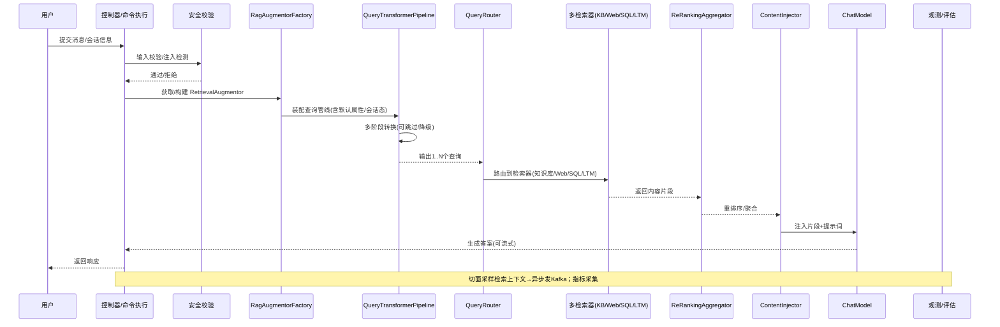

# RAG 系统架构与流程

本文面向当前仓库中已实现的 RAG（Retrieval‑Augmented Generation）能力，梳理端到端调用链、关键组件与配置开关，并给出落地时的扩展点与调优建议。所有类与路径均基于本项目源码实现。

## 1. 系统总览

```mermaid
flowchart LR
  subgraph Client
    U[用户/前端/IDE]
  end

  subgraph Adapter
    API[REST/WebSocket/SSE 控制器]
  end

  subgraph App
    CMD[*CmdExe / *QryExe]
    AOP[RAG事件采集切面]
  end

  subgraph Infrastructure[RAG 基础设施]
    SEC[ChatSecurityValidator]
    RAF[RagAugmentorFactory]\n(QueryRouter/Transformer/Aggregator/Injector)
    QTP[QueryTransformerPipeline\n(Normalize→Align→Intent→Slot→Rewrite→Expand)]
    RTR[QueryRouter]
    RET_KB[EmbeddingStoreContentRetriever\n(知识库检索)]
    RET_WEB[WebSearchContentRetriever\n(Web 搜索)]
    RET_SQL[SqlQueryContentRetriever\n(NL2SQL/直连SQL)]
    RET_LTM[LTMEnhancedContentRetriever\n(个性化长期记忆)]
    AGG[ReRankingContentAggregator\n(可选 ScoringModel)]
    INJ[DefaultContentInjector\n(PromptTemplate)]
  end

  subgraph LLM
    LM[ChatModel / StreamingChatModel]
    EMB[EmbeddingModel]
    SCORE[ScoringModel]
  end

  subgraph Stores
    REDIS_VEC[(Redis Vector\nEmbeddingStore)]
    DB[(业务DB)]
    REDIS_MEM[(ChatMemory / LTM)]
  end

  subgraph Observability[观测与评估]
    MET[Micrometer 指标]
    EVT[RagEvent → Kafka]
  end

  U --> API --> CMD --> SEC --> RAF
  RAF --> QTP --> RTR
  RTR --> RET_KB --> REDIS_VEC
  RTR --> RET_WEB
  RTR --> RET_SQL --> DB
  RTR -. 可选 .-> RET_LTM --> REDIS_MEM
  RET_KB --> AGG
  RET_WEB --> AGG
  RET_SQL --> AGG
  RET_LTM --> AGG
  AGG --> INJ --> LM
  EMB -.> RET_KB
  SCORE -.> AGG
  CMD -.上下文.-> REDIS_MEM
  CMD -.事件/指标.-> MET
  AOP -.采样.-> EVT
```

关键实现：
- 装配工厂：`smartcs-web-infrastructure/src/main/java/com/leyue/smartcs/rag/factory/RagAugmentorFactory.java:1`
- 查询管线：`smartcs-web-infrastructure/src/main/java/com/leyue/smartcs/rag/query/pipeline/QueryTransformerPipeline.java:1`
- 阶段实现：`smartcs-web-infrastructure/src/main/java/com/leyue/smartcs/rag/query/pipeline/stages`（Normalization/Alignment/Intent/Slot/...）
- 检索器：`smartcs-web-infrastructure/src/main/java/com/leyue/smartcs/rag/retriever/LTMEnhancedContentRetriever.java:1`、`smartcs-web-infrastructure/src/main/java/com/leyue/smartcs/rag/content/retriever/SqlQueryContentRetriever.java:1`
- Web 搜索：`smartcs-web-infrastructure/src/main/java/com/leyue/smartcs/rag/config/SearXNGWebSearchConfig.java:1`
- 向量库：`smartcs-web-infrastructure/src/main/java/com/leyue/smartcs/rag/config/RedisEmbeddingStoreConfig.java:1`
- 记忆增强：`smartcs-web-infrastructure/src/main/java/com/leyue/smartcs/rag/memory/LTMEnhancedRedisChatMemoryStore.java:1`
- 观测/评估：`smartcs-web-infrastructure/src/main/java/com/leyue/smartcs/rag/observability/ChatEventListener.java:1`、`smartcs-web-infrastructure/src/main/java/com/leyue/smartcs/rag/observability/ChatMetricsCollector.java:1`、`smartcs-web-app/src/main/java/com/leyue/smartcs/eval/aop/RagEventCollectorAspect.java:1`、`smartcs-web-infrastructure/src/main/java/com/leyue/smartcs/eval/producer/RagEventProducer.java:1`

## 2. 端到端调用流程



与用户提供的逻辑一致：会话上下文与意图引导查询转换，路由多源检索，聚合注入后生成，最后更新上下文并记录事件。

## 3. 查询转换管线（QueryTransformerPipeline）

实现与配置：
- 管线主体：`smartcs-web-infrastructure/src/main/java/com/leyue/smartcs/rag/query/pipeline/QueryTransformerPipeline.java:1`
- 上下文模型：`smartcs-web-infrastructure/src/main/java/com/leyue/smartcs/rag/query/pipeline/QueryContext.java:1`
- 默认装配：`smartcs-web-infrastructure/src/main/java/com/leyue/smartcs/rag/config/QueryTransformerConfiguration.java:1`

阶段一览（按默认顺序）：
- Normalization 标准化：清洗编号/空白/标点，全半角与大小写统一，支持停用词与长度约束（`.../NormalizationStage.java:1`）。
- SemanticAlignment 语义对齐：同义词/术语/单位/时间/实体规范化，优先用字典服务（`.../SemanticAlignmentStage.java:1`）。
- IntentExtraction 意图抽取：结合字典/LLM 的意图分类、实体与槽位提取，结构化到 attributes（`.../IntentExtractionStage.java:1`）。
- SlotFilling 槽位填充：对缺失必填槽位生成澄清问题，可配置“阻断检索”策略（`.../SlotFillingStage.java:1`）。
- PhoneticCorrection 拼音/形近字容错（可选）（`.../services/PhoneticCorrectionService.java:1` + `.../PhoneticCorrectionStage.java`）。
- PrefixCompletion 前缀补全（可选，轻量 Trie + 字典）（`.../services/PrefixCompletionService.java:1` + `.../PrefixCompletionStage.java`）。
- SynonymRecall 近义词召回（可选）（`.../services/SynonymRecallService.java:1` + `.../SynonymRecallStage.java`）。
- Rewrite 可检索化改写：负向词、必含词、关键词加权、语义改写（`.../RewriteStage.java:1`）。
- Expanding LLM 扩展：用 ChatModel 生成多路变体（`.../ExpandingStage.java:1`）。
- ExpansionStrategy 高级策略（可选）：Multi‑Query / Step‑back / HyDE / 融合（`.../ExpansionStrategyStage.java:1`）。

执行特性：
- 超时与预算：`QueryContext.TimeoutControl/BudgetControl` 控制每阶段与整体耗时、token 预算。
- 降级路径：阶段异常默认“跳过阶段/保留原查询”，可通过 `fallbackPolicy` 控制。
- 可观测：MetricsCollector 记录阶段起止/耗时/消耗；`transformWithTrace` 输出阶段变更轨迹。

单元测试：`smartcs-web-infrastructure/src/test/java/com/leyue/smartcs/rag/query/pipeline/QueryTransformerPipelineTest.java:1`

## 4. 检索与路由（QueryRouter）

创建与装配：`smartcs-web-infrastructure/src/main/java/com/leyue/smartcs/rag/factory/RagAugmentorFactory.java:1`

- Router：`LanguageModelQueryRouter`（LangChain4j）基于提示选择检索器；可注入自定义 Prompt。
- 检索器：
  - 知识库：`EmbeddingStoreContentRetriever`（Redis Vector，TopK、minScore、EmbeddingModel 可配）。
  - Web 搜索：`WebSearchContentRetriever`（SearXNG 引擎，可整体开关）。
  - SQL：`SqlQueryContentRetriever`，内置注入防护与 Sentinel 限流/降级（`.../SqlQueryContentRetriever.java:1`）。
  - LTM 个性化：`LTMEnhancedContentRetriever` 按用户记忆加权合并（`.../LTMEnhancedContentRetriever.java:1`）。

聚合与注入：
- 聚合：`ReRankingContentAggregator`，首选 ScoringModel 打分；拿不到则降级为基础聚合。
- 注入：`DefaultContentInjector`，支持 PromptTemplate 与元数据键过滤。

## 5. 知识与向量库

- Redis 向量库配置：`smartcs-web-infrastructure/src/main/java/com/leyue/smartcs/rag/config/RedisEmbeddingStoreConfig.java:1`
- Web 搜索引擎：`smartcs-web-infrastructure/src/main/java/com/leyue/smartcs/rag/config/SearXNGWebSearchConfig.java:1`
- 更多知识库链路（解析/分块/入库/检索）详见：`docs/业务模块-知识库管理模块.md:1`

## 6. 长期记忆（LTM）

- 检索侧增强：将 LTM 个性化片段与知识库结果合并重排（`.../LTMEnhancedContentRetriever.java:1`）。
- 会话记忆增强：在 `ChatMemoryStore` 读取时插入 LTM 上下文；在更新时异步形成记忆（`.../LTMEnhancedRedisChatMemoryStore.java:1`）。
- 个性化聊天 AI Service：`smartcs-web-infrastructure/src/main/java/com/leyue/smartcs/rag/LTMEnhancedSmartChatService.java:1`。

## 7. 观测与评估

- 在线指标：`smartcs-web-infrastructure/src/main/java/com/leyue/smartcs/rag/observability/ChatMetricsCollector.java:1`（请求数/时长/检索条数/错误等）。
- 聊天事件：`smartcs-web-infrastructure/src/main/java/com/leyue/smartcs/rag/observability/ChatEventListener.java:1`。
- 采样与事件：AOP 切面拦截聊天与检索，构建 `RagEvent` 并发 Kafka（`smartcs-web-app/src/main/java/com/leyue/smartcs/eval/aop/RagEventCollectorAspect.java:1`，`smartcs-web-infrastructure/src/main/java/com/leyue/smartcs/eval/producer/RagEventProducer.java:1`）。
- 评估说明：`docs/RAG-评估系统说明.md:1`。

## 8. 安全与治理

- 安全校验：`smartcs-web-infrastructure/src/main/java/com/leyue/smartcs/rag/security/ChatSecurityValidator.java:1`（长度与变量约束、提示注入检测、敏感数据识别/脱敏）。
- SQL 检索：仅允许 `SELECT`，危险关键字黑名单，Sentinel 限流与 fallback（`.../SqlQueryContentRetriever.java:1`）。
- 记忆存取：LTM 注重“读取插入/写入异步”，避免主链路抖动（`.../LTMEnhancedRedisChatMemoryStore.java:1`）。

## 9. 重要配置清单

主配置：`start/src/main/resources/application.yaml:1`

- RAG 管线开关
  - `smartcs.rag.query-transformer.enable-pipeline: true`
- Web 搜索
  - `smartcs.ai.web-search.enabled: false`（全局开关）
  - SearxNG：`smartcs.ai.web-search.searxng.*`
- 向量库/EmbeddingStore
  - `langchain4j.embedding-store.redis.*`、`langchain4j.embedding-store.dimension`
- LTM
  - `smartcs.ai.ltm.retrieval.enabled`、`smartcs.ai.ltm.enabled`、`smartcs.ai.ltm.context.*`
- NL2SQL
  - `smartcs.nlp2sql.enable-nlp-mode`、`smartcs.nlp2sql.min-confidence`
- 评估/事件
  - `eval.enabled`、`eval.sampling.rate`、`eval.kafka.topics.rag-events`

运行期动态组件化配置：`smartcs-web-client/src/main/java/com/leyue/smartcs/dto/app/RagComponentConfig.java:1`
- `queryTransformer`：是否启用各阶段、最大查询数、去重阈值、超时/预算、Prompt、意图识别等。
- `queryRouter`：是否启用 knowledge/web/sql 检索、router Prompt、模型ID。
- `contentAggregator`：`maxResults/minScore/scoringModelId`。
- `contentInjector`：PromptTemplate、元数据键过滤。

## 10. 典型扩展点

- 新增查询阶段：实现 `QueryTransformerStage` 并在 `RagAugmentorFactory#createPipelineStages` 或配置工厂中注册。
- 新增检索器：实现 `ContentRetriever` 并在 `RagAugmentorFactory#createQueryRouter` 中装配/改 Router Prompt。
- 自定义重排：提供 `ScoringModel` 或替换聚合器策略。
- 字典/规则接入：通过 `DictionaryService` 丰富意图/术语/改写/扩展规则，开箱即用地影响多个阶段。

## 11. 调优与最佳实践

- 查询前处理：默认开启 Normalization/Alignment/Rewrite，显著降低口语化与噪声影响。
- 扩展与路由：在未使用 Router 打分的场景，`maxQueries` 不宜过大，以免重排歧义；默认工厂已在未配 selector 时将 `maxQueries` 限至 1。
- 重排成本：优先为主干模型提供 `ScoringModel`；否则降级基础聚合并收紧 `minScore`。
- LTM：合理设置 `ltmWeight/max-results/threshold`，避免个性化内容淹没权威知识。
- NL2SQL：提升 `min-confidence`，为低置信度结果返回友好提示而非执行未知 SQL。

## 12. 本地运行与验证

- 编译：`mvn -q -DskipTests compile`
- 运行：`cd start && mvn spring-boot:run`
- 单测：`mvn -Dtest=QueryTransformerPipelineTest test`
- 质量闸门（参考）：`scripts/baseline-eval.sh:1`

---

参考文档：
- RAG 评估系统说明：`docs/RAG-评估系统说明.md:1`
- 知识库管理模块：`docs/业务模块-知识库管理模块.md:1`
