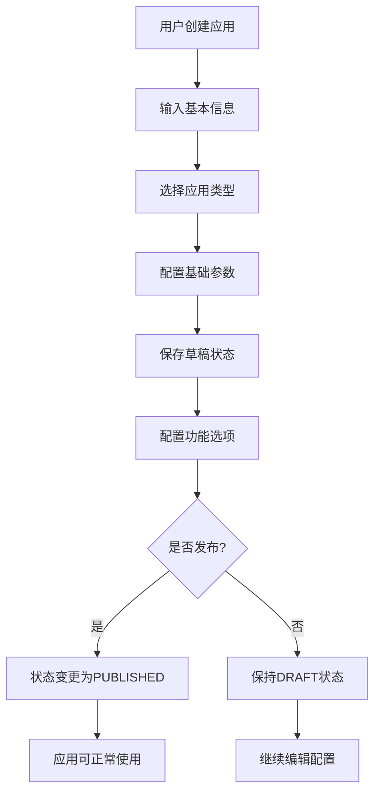
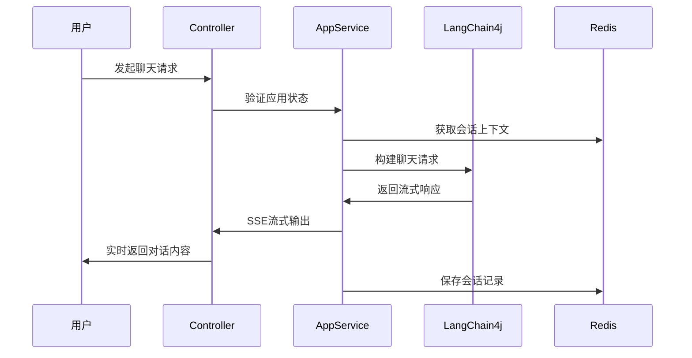

# AI应用模块

## 模块概述

AI应用模块是SmartCS Web平台的核心业务模块之一，负责AI应用的全生命周期管理，包括应用创建、配置、发布、运行和监控。该模块基于LangChain4j框架，为用户提供简单易用的AI应用构建和运行环境。

## 核心能力

### 1. 应用生命周期管理
- **应用创建**: 支持从模板或自定义创建AI应用
- **配置管理**: 提供丰富的应用配置选项
- **状态管理**: 草稿(DRAFT) → 发布(PUBLISHED) → 禁用(DISABLED)
- **版本控制**: 支持应用配置的版本管理和回滚

### 2. 智能对话能力
- **流式对话**: 基于SSE的实时流式响应
- **会话管理**: 支持多轮对话和上下文保持
- **Prompt优化**: 自动优化Prompt以提升对话质量
- **功能配置**: 支持工具调用、知识库检索等功能

### 3. 应用市场功能
- **公开发布**: 支持将应用发布到公开市场
- **预览功能**: 提供应用预览和试用体验
- **分类管理**: 支持按类型和标签分类管理应用

## 核心实体

### AiApp（AI应用实体）
```java
@Data @Builder
public class AiApp {
    private Long id;              // 主键ID
    private String name;          // 应用名称
    private String code;          // 应用唯一编码
    private String description;   // 应用描述
    private AppType type;         // 应用类型
    private Map<String, Object> config; // 应用配置信息
    private AppStatus status;     // 应用状态
    private String icon;          // 应用图标
    private List<String> tags;    // 应用标签
    private String createdBy;     // 创建者
    private Long createdAt;       // 创建时间
    private Long updatedAt;       // 更新时间
}
```

### AppStatus（应用状态枚举）
- `DRAFT`: 草稿状态，可编辑但不可使用
- `PUBLISHED`: 已发布状态，可正常使用
- `DISABLED`: 已禁用状态，暂停使用

### AppType（应用类型枚举）
- `CHAT`: 对话型应用
- `ASSISTANT`: 助手型应用
- `WORKFLOW`: 工作流应用

## API接口

### 管理端接口（Admin）

#### 1. 应用CRUD操作
```
POST   /api/admin/app              # 创建应用
PUT    /api/admin/app              # 更新应用
GET    /api/admin/app/{id}         # 获取应用详情
DELETE /api/admin/app/{id}         # 删除应用
GET    /api/admin/app              # 分页查询应用列表
```

#### 2. 应用状态管理
```
PUT    /api/admin/app/status       # 更新应用状态
```

#### 3. 功能配置管理
```
PUT    /api/admin/app/{id}/function-config  # 更新功能配置
GET    /api/admin/app/{id}/function-config  # 获取功能配置
```

#### 4. Prompt优化
```
POST   /api/admin/app/optimize-prompt       # 优化Prompt
```

#### 5. 应用测试
```
POST   /api/admin/app/chat                  # AI应用聊天（SSE流式）
```

### 公开端接口（Public）

#### 1. 应用访问
```
GET    /api/app/{id}               # 获取公开应用信息（仅已发布）
POST   /api/app/chat               # 公开应用聊天（SSE流式）
```

## 数据模型

### 数据库表结构

#### ai_app（AI应用表）
```sql
CREATE TABLE ai_app (
    id          BIGINT PRIMARY KEY AUTO_INCREMENT,
    name        VARCHAR(128) NOT NULL,
    code        VARCHAR(64) UNIQUE NOT NULL,
    description TEXT,
    type        VARCHAR(32) NOT NULL,
    config      JSON,
    status      VARCHAR(32) NOT NULL,
    icon        VARCHAR(512),
    tags        JSON,
    created_by  VARCHAR(64),
    updated_by  VARCHAR(64),
    created_at  BIGINT NOT NULL,
    updated_at  BIGINT NOT NULL
);
```

## 业务流程

### 1. 应用创建流程



### 2. 应用对话流程



## 技术实现

### 1. 核心技术栈
- **LangChain4j**: LLM集成和对话管理
- **Spring Boot**: Web框架和依赖注入
- **MyBatis-Plus**: 数据持久化
- **Redis**: 会话状态和缓存管理
- **SSE**: 服务器推送事件（流式响应）

### 2. 关键组件

#### AiAppService（应用服务）
```java
@Service
public class AiAppService {
    // 应用CRUD操作
    SingleResponse<AiAppDTO> createApp(AiAppCreateCmd cmd);
    Response updateApp(AiAppUpdateCmd cmd);
    SingleResponse<AiAppDTO> getApp(Long id);
    Response deleteApp(Long id);
    
    // 应用功能
    SseEmitter chatWithAppSSE(AiAppChatCmd cmd);
    SingleResponse<AiAppPromptOptimizeResponse> optimizePrompt(AiAppPromptOptimizeCmd cmd);
    Response updateFunctionConfig(AiAppFunctionConfigCmd cmd);
}
```

#### AiAppChatCmdExe（聊天执行器）
```java
@Component
public class AiAppChatCmdExe {
    @Autowired
    private ChatLanguageModel chatModel;
    
    @Autowired
    private ConversationMemory conversationMemory;
    
    public SseEmitter execute(AiAppChatCmd cmd) {
        // 构建对话上下文
        // 调用LangChain4j进行对话
        // 返回SSE流式响应
    }
}
```

### 3. 配置管理

#### 应用配置结构
```json
{
    "model": {
        "provider": "openai",
        "modelName": "gpt-4",
        "temperature": 0.7,
        "maxTokens": 2048
    },
    "prompt": {
        "systemPrompt": "你是一个智能助手...",
        "userPromptTemplate": "用户问题：{question}"
    },
    "features": {
        "knowledgeBase": {
            "enabled": true,
            "knowledgeBaseId": 1,
            "similarityThreshold": 0.8
        },
        "tools": {
            "enabled": true,
            "availableTools": ["web_search", "calculator"]
        },
        "memory": {
            "enabled": true,
            "maxHistory": 10
        }
    },
    "limits": {
        "maxRequestPerDay": 1000,
        "maxTokensPerRequest": 4096
    }
}
```

## 扩展点

### 1. 插件化架构
- 支持自定义工具插件
- 支持自定义Prompt模板
- 支持自定义后处理器

### 2. 多模态支持
- 文本对话
- 图像理解
- 语音交互

### 3. 企业功能
- 应用权限管理
- 使用量统计和监控
- API调用限制

## 相关模块

- **智能聊天模块**: 提供会话管理能力
- **知识库模块**: 提供知识检索能力  
- **AI模型管理模块**: 提供模型配置能力
- **RAG检索模块**: 提供检索增强生成能力

## 文件路径

### 核心文件
- **Controller**: `/smartcs-web-adapter/src/main/java/com/leyue/smartcs/web/app/`
- **Domain**: `/smartcs-web-domain/src/main/java/com/leyue/smartcs/domain/app/`
- **App Service**: `/smartcs-web-app/src/main/java/com/leyue/smartcs/app/executor/`
- **Infrastructure**: `/smartcs-web-infrastructure/src/main/java/com/leyue/smartcs/app/`
- **Client DTO**: `/smartcs-web-client/src/main/java/com/leyue/smartcs/dto/app/`