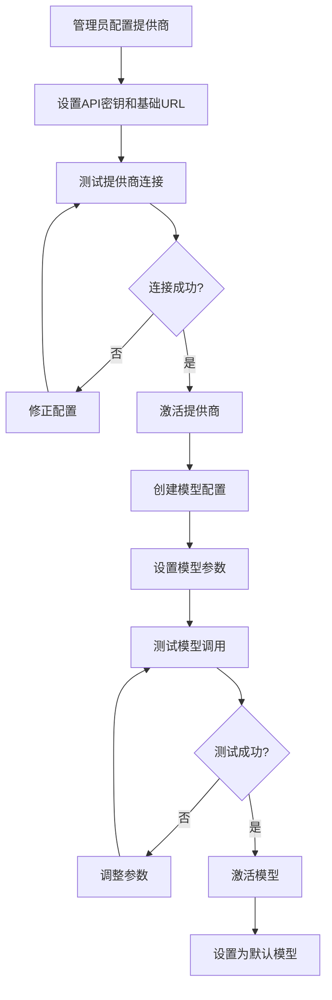
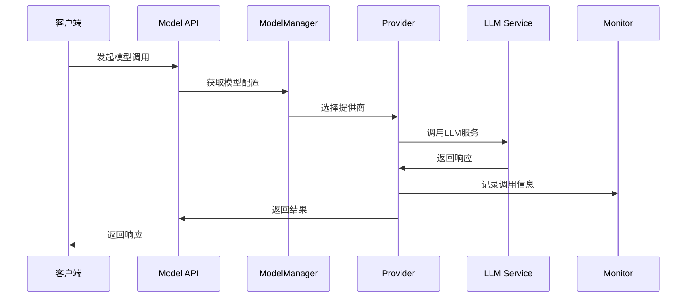
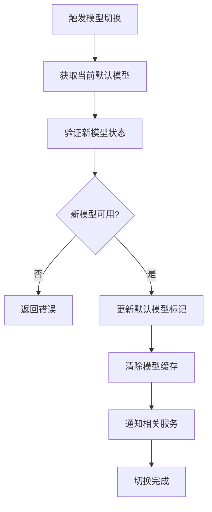

# AI模型管理模块

## 模块概述

AI模型管理模块是SmartCS Web平台的基础服务模块，负责AI大语言模型的配置、管理、调用和监控。该模块基于LangChain4j框架，支持多种模型提供商（OpenAI、Ollama等），提供统一的模型访问接口和灵活的配置管理能力。

## 核心能力

### 1. 模型提供商管理
- **多提供商支持**: 支持OpenAI、Ollama、Azure OpenAI等多种提供商
- **提供商配置**: 支持API密钥、基础URL、请求参数等配置管理
- **提供商切换**: 支持不同提供商之间的无缝切换
- **负载均衡**: 支持多个提供商实例的负载均衡

### 2. 模型配置管理
- **模型注册**: 支持新模型的注册和配置
- **参数配置**: 支持temperature、top_p、max_tokens等参数配置
- **模型版本**: 支持模型版本的管理和切换
- **默认配置**: 支持系统默认模型配置

### 3. 模型调用服务
- **统一接口**: 提供统一的模型调用接口
- **流式响应**: 支持流式和非流式两种调用模式
- **错误处理**: 提供完善的错误处理和重试机制
- **调用监控**: 提供模型调用的性能监控和统计

### 4. 模型能力抽象
- **聊天模型**: 支持对话型模型的统一接口
- **嵌入模型**: 支持文本向量化模型
- **图像模型**: 支持图像理解和生成模型
- **工具调用**: 支持Function Calling和Tool Use

## 核心实体

### Model（模型实体）
```java
@Data @Builder
public class Model {
    private Long id;              // 模型ID
    private String name;          // 模型名称
    private String code;          // 模型唯一编码
    private String description;   // 模型描述
    private String provider;      // 提供商编码
    private String modelName;     // 提供商模型名称
    private ModelType type;       // 模型类型
    private Map<String, Object> config; // 模型配置
    private ModelStatus status;   // 模型状态
    private Boolean isDefault;    // 是否默认模型
    private Long createdAt;       // 创建时间
    private Long updatedAt;       // 更新时间
}
```

### Provider（提供商实体）
```java
@Data @Builder
public class Provider {
    private Long id;              // 提供商ID
    private String code;          // 提供商编码
    private String name;          // 提供商名称
    private String description;   // 描述信息
    private ProviderType type;    // 提供商类型
    private Map<String, Object> config; // 提供商配置
    private ProviderStatus status; // 提供商状态
    private Integer priority;     // 优先级
    private Long createdAt;       // 创建时间
    private Long updatedAt;       // 更新时间
}
```

### ModelInvokeRecord（模型调用记录）
```java
@Data @Builder
public class ModelInvokeRecord {
    private Long id;              // 记录ID
    private String modelCode;     // 模型编码
    private String provider;      // 提供商
    private String requestId;     // 请求ID
    private Integer inputTokens;  // 输入Token数
    private Integer outputTokens; // 输出Token数
    private Long responseTime;    // 响应时间（毫秒）
    private Boolean success;      // 是否成功
    private String errorMessage;  // 错误信息
    private Long timestamp;       // 调用时间戳
}
```

### 枚举定义

#### ModelType（模型类型）
- `CHAT`: 对话模型
- `EMBEDDING`: 嵌入模型
- `IMAGE`: 图像模型
- `AUDIO`: 音频模型

#### ModelStatus（模型状态）
- `ACTIVE`: 激活状态，可正常使用
- `INACTIVE`: 未激活状态，不可使用
- `TESTING`: 测试状态，仅供测试
- `DEPRECATED`: 已废弃状态

#### ProviderType（提供商类型）
- `OPENAI`: OpenAI提供商
- `AZURE_OPENAI`: Azure OpenAI提供商
- `OLLAMA`: Ollama本地提供商
- `CUSTOM`: 自定义提供商

#### ProviderStatus（提供商状态）
- `ACTIVE`: 激活状态
- `INACTIVE`: 未激活状态
- `MAINTENANCE`: 维护状态

## API接口

### 模型管理接口

#### 管理端模型接口
```
POST   /api/admin/models                   # 创建模型
PUT    /api/admin/models                   # 更新模型
GET    /api/admin/models/{id}              # 获取模型详情
DELETE /api/admin/models/{id}              # 删除模型
GET    /api/admin/models                   # 分页查询模型列表
PUT    /api/admin/models/{id}/status       # 更新模型状态
PUT    /api/admin/models/{id}/default      # 设置默认模型
```

#### 客户端模型接口
```
GET    /api/models                         # 获取可用模型列表
GET    /api/models/{code}                  # 获取模型信息
```

### 提供商管理接口

#### 管理端提供商接口
```
POST   /api/admin/providers                # 创建提供商
PUT    /api/admin/providers                # 更新提供商
GET    /api/admin/providers/{id}           # 获取提供商详情
DELETE /api/admin/providers/{id}           # 删除提供商
GET    /api/admin/providers                # 查询提供商列表
PUT    /api/admin/providers/{id}/status    # 更新提供商状态
POST   /api/admin/providers/{id}/test      # 测试提供商连接
```

#### 客户端提供商接口
```
GET    /api/providers                      # 获取可用提供商列表
```

### 模型调用接口

#### 聊天接口
```
POST   /api/models/chat                    # 单次对话请求
POST   /api/models/chat/stream             # 流式对话请求（SSE）
```

#### 嵌入接口
```
POST   /api/models/embeddings              # 文本向量化
POST   /api/models/embeddings/batch        # 批量向量化
```

### 监控接口
```
GET    /api/admin/models/stats             # 模型使用统计
GET    /api/admin/models/health            # 模型健康检查
GET    /api/admin/models/invoke-records    # 调用记录查询
```

## 数据模型

### 数据库表结构

#### ai_model（AI模型表）
```sql
CREATE TABLE ai_model (
    id          BIGINT PRIMARY KEY AUTO_INCREMENT,
    name        VARCHAR(128) NOT NULL,
    code        VARCHAR(64) UNIQUE NOT NULL,
    description TEXT,
    provider    VARCHAR(64) NOT NULL,
    model_name  VARCHAR(128) NOT NULL,
    type        VARCHAR(32) NOT NULL,
    config      JSON,
    status      VARCHAR(32) DEFAULT 'ACTIVE',
    is_default  BOOLEAN DEFAULT FALSE,
    created_at  BIGINT NOT NULL,
    updated_at  BIGINT NOT NULL,
    INDEX idx_provider (provider),
    INDEX idx_type_status (type, status),
    INDEX idx_default (is_default)
);
```

#### ai_provider（AI提供商表）
```sql
CREATE TABLE ai_provider (
    id          BIGINT PRIMARY KEY AUTO_INCREMENT,
    code        VARCHAR(64) UNIQUE NOT NULL,
    name        VARCHAR(128) NOT NULL,
    description TEXT,
    type        VARCHAR(32) NOT NULL,
    config      JSON NOT NULL,
    status      VARCHAR(32) DEFAULT 'ACTIVE',
    priority    INT DEFAULT 0,
    created_at  BIGINT NOT NULL,
    updated_at  BIGINT NOT NULL,
    INDEX idx_type_status (type, status),
    INDEX idx_priority (priority)
);
```

#### model_invoke_record（模型调用记录表）
```sql
CREATE TABLE model_invoke_record (
    id            BIGINT PRIMARY KEY AUTO_INCREMENT,
    model_code    VARCHAR(64) NOT NULL,
    provider      VARCHAR(64) NOT NULL,
    request_id    VARCHAR(128),
    input_tokens  INT,
    output_tokens INT,
    response_time BIGINT,
    success       BOOLEAN DEFAULT TRUE,
    error_message TEXT,
    timestamp     BIGINT NOT NULL,
    INDEX idx_model_time (model_code, timestamp),
    INDEX idx_provider_time (provider, timestamp),
    INDEX idx_success (success)
);
```

## 业务流程

### 1. 模型配置流程



### 2. 模型调用流程



### 3. 模型切换流程



## 技术实现

### 1. 核心技术栈
- **LangChain4j**: LLM集成框架
- **Spring Boot**: Web框架
- **Redis**: 模型配置缓存
- **Micrometer**: 性能监控
- **Resilience4j**: 熔断和重试

### 2. 关键组件

#### ModelService（模型服务）
```java
@Service
public class ModelService {
    
    @Autowired
    private ModelGateway modelGateway;
    
    @Autowired
    private ModelProviderFactory providerFactory;
    
    public SingleResponse<ModelDTO> createModel(ModelCreateCmd cmd) {
        // 验证提供商是否存在且可用
        Provider provider = validateProvider(cmd.getProvider());
        
        // 创建模型实体
        Model model = Model.builder()
            .name(cmd.getName())
            .code(cmd.getCode())
            .provider(cmd.getProvider())
            .modelName(cmd.getModelName())
            .type(cmd.getType())
            .config(cmd.getConfig())
            .status(ModelStatus.ACTIVE)
            .createdAt(System.currentTimeMillis())
            .updatedAt(System.currentTimeMillis())
            .build();
        
        // 保存模型
        Model savedModel = modelGateway.save(model);
        
        // 清除缓存
        modelCacheService.evict(cmd.getCode());
        
        return SingleResponse.of(ModelConvertor.toDTO(savedModel));
    }
    
    public Response setDefaultModel(Long modelId) {
        Model model = modelGateway.findById(modelId);
        if (model == null) {
            return Response.buildFailure("MODEL_NOT_FOUND", "模型不存在");
        }
        
        // 取消当前默认模型
        modelGateway.updateDefaultModel(model.getType(), false);
        
        // 设置新的默认模型
        model.setIsDefault(true);
        modelGateway.save(model);
        
        // 清除缓存
        modelCacheService.evictDefaultModel(model.getType());
        
        return Response.buildSuccess();
    }
}
```

#### ModelProviderFactory（模型提供商工厂）
```java
@Component
public class ModelProviderFactory {
    
    private final Map<ProviderType, ModelProvider> providers = new HashMap<>();
    
    @PostConstruct
    public void initProviders() {
        providers.put(ProviderType.OPENAI, new OpenAIProvider());
        providers.put(ProviderType.AZURE_OPENAI, new AzureOpenAIProvider());
        providers.put(ProviderType.OLLAMA, new OllamaProvider());
        providers.put(ProviderType.CUSTOM, new CustomProvider());
    }
    
    public ModelProvider getProvider(String providerCode) {
        Provider config = providerGateway.findByCode(providerCode);
        if (config == null || config.getStatus() != ProviderStatus.ACTIVE) {
            throw new BizException("提供商不可用: " + providerCode);
        }
        
        ModelProvider provider = providers.get(config.getType());
        if (provider == null) {
            throw new BizException("不支持的提供商类型: " + config.getType());
        }
        
        provider.configure(config.getConfig());
        return provider;
    }
}
```

#### ChatLanguageModelManager（聊天模型管理器）
```java
@Component
public class ChatLanguageModelManager {
    
    @Autowired
    private ModelProviderFactory providerFactory;
    
    @Autowired
    private ModelInvokeRecorder recorder;
    
    public String chat(String modelCode, String message, Map<String, Object> options) {
        Model model = getModel(modelCode);
        ModelProvider provider = providerFactory.getProvider(model.getProvider());
        
        long startTime = System.currentTimeMillis();
        String requestId = UUID.randomUUID().toString();
        
        try {
            // 构建请求参数
            ChatRequest request = buildChatRequest(model, message, options);
            
            // 调用模型
            ChatResponse response = provider.chat(request);
            
            // 记录调用信息
            recordInvoke(model, requestId, request, response, System.currentTimeMillis() - startTime, true, null);
            
            return response.getContent();
            
        } catch (Exception e) {
            // 记录错误信息
            recordInvoke(model, requestId, null, null, System.currentTimeMillis() - startTime, false, e.getMessage());
            throw new BizException("模型调用失败: " + e.getMessage(), e);
        }
    }
    
    public SseEmitter chatStream(String modelCode, String message, Map<String, Object> options) {
        Model model = getModel(modelCode);
        ModelProvider provider = providerFactory.getProvider(model.getProvider());
        
        SseEmitter emitter = new SseEmitter(60000L);
        String requestId = UUID.randomUUID().toString();
        
        CompletableFuture.runAsync(() -> {
            try {
                ChatRequest request = buildChatRequest(model, message, options);
                
                provider.chatStream(request, new StreamCallback() {
                    @Override
                    public void onNext(String content) {
                        try {
                            emitter.send(SseEmitter.event().data(content));
                        } catch (IOException e) {
                            log.error("发送SSE数据失败", e);
                            emitter.completeWithError(e);
                        }
                    }
                    
                    @Override
                    public void onComplete() {
                        emitter.complete();
                    }
                    
                    @Override
                    public void onError(Throwable error) {
                        emitter.completeWithError(error);
                    }
                });
                
            } catch (Exception e) {
                emitter.completeWithError(e);
            }
        });
        
        return emitter;
    }
}
```

### 3. 提供商实现

#### OpenAIProvider（OpenAI提供商）
```java
@Component
public class OpenAIProvider implements ModelProvider {
    
    private ChatLanguageModel chatModel;
    private EmbeddingModel embeddingModel;
    
    @Override
    public void configure(Map<String, Object> config) {
        String apiKey = (String) config.get("apiKey");
        String baseUrl = (String) config.get("baseUrl");
        
        this.chatModel = OpenAiChatModel.builder()
            .apiKey(apiKey)
            .baseUrl(baseUrl)
            .build();
            
        this.embeddingModel = OpenAiEmbeddingModel.builder()
            .apiKey(apiKey)
            .baseUrl(baseUrl)
            .build();
    }
    
    @Override
    public ChatResponse chat(ChatRequest request) {
        dev.langchain4j.model.chat.ChatLanguageModel model = (dev.langchain4j.model.chat.ChatLanguageModel) chatModel;
        
        String response = model.generate(request.getMessage());
        
        return ChatResponse.builder()
            .content(response)
            .model(request.getModelName())
            .build();
    }
    
    @Override
    public void chatStream(ChatRequest request, StreamCallback callback) {
        try {
            StreamingChatLanguageModel streamingModel = OpenAiStreamingChatModel.builder()
                .apiKey(getApiKey())
                .baseUrl(getBaseUrl())
                .build();
            
            streamingModel.generate(request.getMessage(), new StreamingResponseHandler<AiMessage>() {
                @Override
                public void onNext(String token) {
                    callback.onNext(token);
                }
                
                @Override
                public void onComplete(Response<AiMessage> response) {
                    callback.onComplete();
                }
                
                @Override
                public void onError(Throwable error) {
                    callback.onError(error);
                }
            });
            
        } catch (Exception e) {
            callback.onError(e);
        }
    }
    
    @Override
    public List<Float> embed(String text) {
        Response<Embedding> response = embeddingModel.embed(text);
        return response.content().vectorAsList();
    }
}
```

#### OllamaProvider（Ollama提供商）
```java
@Component
public class OllamaProvider implements ModelProvider {
    
    private OllamaChatModel chatModel;
    private OllamaEmbeddingModel embeddingModel;
    
    @Override
    public void configure(Map<String, Object> config) {
        String baseUrl = (String) config.get("baseUrl");
        Integer timeout = (Integer) config.get("timeout");
        
        this.chatModel = OllamaChatModel.builder()
            .baseUrl(baseUrl)
            .timeout(Duration.ofSeconds(timeout != null ? timeout : 60))
            .build();
            
        this.embeddingModel = OllamaEmbeddingModel.builder()
            .baseUrl(baseUrl)
            .timeout(Duration.ofSeconds(timeout != null ? timeout : 60))
            .build();
    }
    
    @Override
    public ChatResponse chat(ChatRequest request) {
        OllamaChatModel model = (OllamaChatModel) chatModel;
        
        String response = model.generate(request.getMessage());
        
        return ChatResponse.builder()
            .content(response)
            .model(request.getModelName())
            .build();
    }
    
    @Override
    public boolean testConnection() {
        try {
            // 简单的健康检查请求
            chatModel.generate("Hello");
            return true;
        } catch (Exception e) {
            log.error("Ollama连接测试失败", e);
            return false;
        }
    }
}
```

### 4. 调用监控和统计

#### ModelInvokeRecorder（调用记录器）
```java
@Component
public class ModelInvokeRecorder {
    
    @Autowired
    private ModelInvokeRecordGateway recordGateway;
    
    @Async
    public void record(ModelInvokeRecord record) {
        try {
            recordGateway.save(record);
            
            // 更新统计信息
            updateModelStats(record);
            
        } catch (Exception e) {
            log.error("记录模型调用失败", e);
        }
    }
    
    private void updateModelStats(ModelInvokeRecord record) {
        String statsKey = String.format("model:stats:%s:%s", 
            record.getModelCode(), 
            LocalDate.now().toString());
        
        redisTemplate.opsForHash().increment(statsKey, "total_calls", 1);
        redisTemplate.opsForHash().increment(statsKey, "total_input_tokens", record.getInputTokens());
        redisTemplate.opsForHash().increment(statsKey, "total_output_tokens", record.getOutputTokens());
        redisTemplate.opsForHash().increment(statsKey, "total_response_time", record.getResponseTime());
        
        if (!record.getSuccess()) {
            redisTemplate.opsForHash().increment(statsKey, "error_count", 1);
        }
        
        // 设置过期时间
        redisTemplate.expire(statsKey, Duration.ofDays(30));
    }
}
```

#### ModelHealthChecker（模型健康检查）
```java
@Component
public class ModelHealthChecker {
    
    @Scheduled(fixedDelay = 300000) // 每5分钟检查一次
    public void checkModelsHealth() {
        List<Model> activeModels = modelGateway.findActiveModels();
        
        for (Model model : activeModels) {
            try {
                ModelProvider provider = providerFactory.getProvider(model.getProvider());
                boolean healthy = provider.testConnection();
                
                if (!healthy) {
                    // 发送告警
                    alertService.sendModelUnhealthyAlert(model);
                    
                    // 记录不健康状态
                    recordUnhealthyStatus(model);
                }
                
            } catch (Exception e) {
                log.error("检查模型健康状态失败: {}", model.getCode(), e);
            }
        }
    }
}
```

## 性能优化

### 1. 调用性能优化
- **连接池管理**: HTTP连接池的优化配置
- **请求重试**: 智能的请求重试和熔断机制
- **批量处理**: 批量请求的合并处理
- **异步调用**: 非阻塞的异步模型调用

### 2. 缓存优化
- **模型配置缓存**: 模型配置信息的多级缓存
- **提供商缓存**: 提供商实例的缓存复用
- **结果缓存**: 相同请求结果的缓存（可选）

### 3. 监控优化
- **指标聚合**: 调用指标的实时聚合
- **批量记录**: 调用记录的批量入库
- **异步处理**: 监控数据的异步处理

## 扩展点

### 1. 新提供商支持
- 插件化的提供商扩展机制
- 标准的提供商接口定义
- 动态提供商注册和发现

### 2. 高级功能
- 模型路由和负载均衡
- 成本优化和预算控制
- 模型性能基准测试

### 3. 企业功能
- 模型使用审计和报表
- 细粒度的访问控制
- 多环境模型配置管理

## 相关模块

- **AI应用模块**: 为AI应用提供模型调用能力
- **知识库模块**: 提供文本向量化能力
- **智能聊天模块**: 提供对话模型能力
- **RAG检索模块**: 提供嵌入模型能力

## 文件路径

### 核心文件
- **Controller**: `/smartcs-web-adapter/src/main/java/com/leyue/smartcs/web/model/`
- **Domain**: `/smartcs-web-domain/src/main/java/com/leyue/smartcs/domain/model/`
- **App Service**: `/smartcs-web-app/src/main/java/com/leyue/smartcs/model/executor/`
- **Infrastructure**: `/smartcs-web-infrastructure/src/main/java/com/leyue/smartcs/model/`
- **Client DTO**: `/smartcs-web-client/src/main/java/com/leyue/smartcs/dto/model/`
- **Provider**: `/smartcs-web-infrastructure/src/main/java/com/leyue/smartcs/provider/`