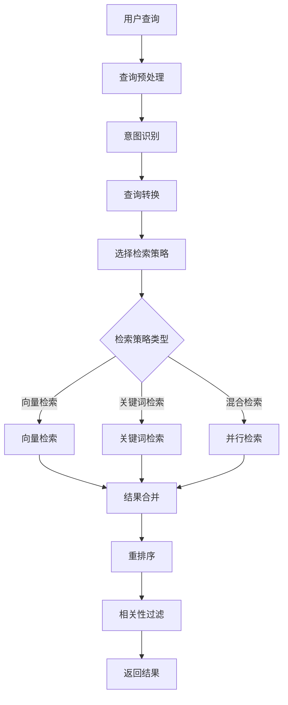
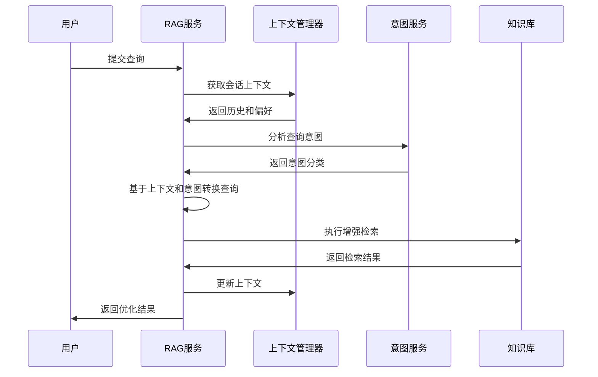
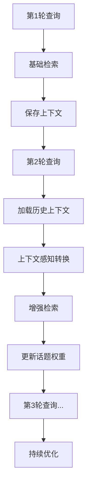

# RAG检索增强模块

## 模块概述

RAG（Retrieval-Augmented Generation）检索增强模块是SmartCS Web平台的核心AI能力模块，负责将外部知识库与大语言模型相结合，通过检索相关知识来增强生成质量。该模块提供智能查询转换、多策略检索、结果合并、意图感知等高级功能。

## 核心能力

### 1. 智能查询转换
- **查询重写**: 基于用户意图和历史上下文优化查询语句
- **查询扩展**: 通过同义词、相关概念扩展查询范围
- **意图感知**: 结合意图分类结果调整检索策略
- **多轮对话**: 维护对话历史，支持上下文相关的查询转换

### 2. 多策略检索
- **向量检索**: 基于语义相似度的向量检索
- **关键词检索**: 基于BM25等算法的关键词检索
- **混合检索**: 结合向量和关键词检索的混合策略
- **重排序**: 基于多种因素对检索结果重新排序

### 3. 结果融合与优化
- **多源融合**: 融合多个知识库的检索结果
- **去重处理**: 智能去除重复和相似的检索结果
- **相关性评分**: 基于多维度计算内容相关性得分
- **结果筛选**: 根据置信度和相关性筛选最佳结果

### 4. 上下文管理
- **对话记忆**: 维护多轮对话的上下文信息
- **历史感知**: 基于历史查询优化当前检索
- **会话状态**: 管理会话级别的检索状态和偏好
- **个性化**: 基于用户行为和偏好个性化检索结果

### 5. 检索管道编排
- **管道配置**: 灵活配置检索管道的各个阶段
- **策略选择**: 基于场景动态选择最优检索策略
- **并行处理**: 支持多路并行检索提升性能
- **异常处理**: 完善的异常处理和降级机制

## 核心实体

### QueryTransformRequest（查询转换请求）
```java
@Data @Builder
public class QueryTransformRequest {
    private String originalQuery;     // 原始查询
    private String sessionId;         // 会话ID
    private List<String> history;     // 历史查询
    private Map<String, Object> context; // 上下文信息
    private String intentCode;        // 意图编码
    private TransformStrategy strategy; // 转换策略
}
```

### RetrievalRequest（检索请求）
```java
@Data @Builder
public class RetrievalRequest {
    private String query;             // 检索查询
    private List<Long> knowledgeBaseIds; // 知识库ID列表
    private RetrievalStrategy strategy; // 检索策略
    private Integer topK;             // 返回结果数量
    private Double threshold;         // 相似度阈值
    private Map<String, Object> filters; // 过滤条件
    private String sessionId;         // 会话ID
}
```

### RetrievalResult（检索结果）
```java
@Data @Builder
public class RetrievalResult {
    private String id;                // 结果ID
    private String title;             // 标题
    private String content;           // 内容
    private String summary;           // 摘要
    private Double score;             // 相关性得分
    private String source;            // 来源信息
    private Map<String, Object> metadata; // 元数据
    private Long knowledgeBaseId;     // 知识库ID
    private Long timestamp;           // 检索时间
}
```

### RAGContext（RAG上下文）
```java
@Data @Builder
public class RAGContext {
    private String sessionId;         // 会话ID
    private List<String> queryHistory; // 查询历史
    private List<String> responseHistory; // 响应历史
    private Map<String, Object> userPreferences; // 用户偏好
    private String currentIntent;     // 当前意图
    private Map<String, Double> topicWeights; // 话题权重
}
```

### 枚举定义

#### TransformStrategy（转换策略）
- `SIMPLE`: 简单转换，基本的查询清理
- `CONTEXTUAL`: 上下文感知转换
- `INTENT_AWARE`: 意图感知转换
- `HISTORICAL`: 历史感知转换

#### RetrievalStrategy（检索策略）
- `VECTOR_ONLY`: 仅向量检索
- `KEYWORD_ONLY`: 仅关键词检索
- `HYBRID`: 混合检索
- `ADAPTIVE`: 自适应策略选择

#### RerankingMethod（重排序方法）
- `SCORE_BASED`: 基于分数的排序
- `DIVERSITY_AWARE`: 多样性感知排序
- `RELEVANCE_OPTIMIZED`: 相关性优化排序

## API接口

### 查询转换接口
```
POST   /api/rag/transform                  # 查询转换
POST   /api/admin/rag/transform/debug      # 调试查询转换
GET    /api/admin/rag/transform/strategies # 获取转换策略列表
```

### 检索接口
```
POST   /api/rag/retrieve                   # 执行检索
POST   /api/rag/retrieve/batch             # 批量检索
POST   /api/admin/rag/retrieve/test        # 检索测试
```

### 管道配置接口
```
GET    /api/admin/rag/pipelines            # 获取管道配置
PUT    /api/admin/rag/pipelines/{id}       # 更新管道配置
POST   /api/admin/rag/pipelines/test       # 测试管道配置
```

### 调试接口
```
POST   /api/admin/rag/debug/transform      # 调试查询转换
POST   /api/admin/rag/debug/retrieve       # 调试检索过程
GET    /api/admin/rag/debug/context/{sessionId} # 获取会话上下文
```

## 技术实现

### 1. 核心技术栈
- **LangChain4j**: 检索链和转换器
- **Redis Vector**: 向量检索
- **Elasticsearch**: 全文检索（可选）
- **Spring AI**: AI模型集成
- **Apache Lucene**: 文本分析和评分

### 2. 关键组件

#### QueryTransformOrchestrator（查询转换编排器）
```java
@Component
public class QueryTransformOrchestrator {
    
    @Autowired
    private List<QueryTransformer> transformers;
    
    @Autowired
    private RAGContextManager contextManager;
    
    public QueryTransformResult transform(QueryTransformRequest request) {
        // 获取会话上下文
        RAGContext context = contextManager.getContext(request.getSessionId());
        
        // 选择转换策略
        TransformStrategy strategy = selectStrategy(request, context);
        
        // 执行转换管道
        String transformedQuery = request.getOriginalQuery();
        
        for (QueryTransformer transformer : transformers) {
            if (transformer.supports(strategy)) {
                transformedQuery = transformer.transform(transformedQuery, request, context);
            }
        }
        
        // 更新上下文
        contextManager.updateContext(request.getSessionId(), request.getOriginalQuery(), transformedQuery);
        
        return QueryTransformResult.builder()
            .originalQuery(request.getOriginalQuery())
            .transformedQuery(transformedQuery)
            .strategy(strategy)
            .transformers(getUsedTransformers())
            .build();
    }
}
```

#### IntentAwareQueryTransformer（意图感知查询转换器）
```java
@Component
public class IntentAwareQueryTransformer implements QueryTransformer {
    
    @Autowired
    private IntentClassificationService intentService;
    
    @Autowired
    private ChatLanguageModel chatModel;
    
    @Override
    public boolean supports(TransformStrategy strategy) {
        return strategy == TransformStrategy.INTENT_AWARE || strategy == TransformStrategy.CONTEXTUAL;
    }
    
    @Override
    public String transform(String query, QueryTransformRequest request, RAGContext context) {
        // 获取意图分类结果
        String intentCode = request.getIntentCode();
        if (StringUtils.isEmpty(intentCode)) {
            IntentClassifyResult intentResult = intentService.classify(
                IntentClassifyCmd.builder()
                    .text(query)
                    .channel("default")
                    .tenant("default")
                    .build()
            ).getData();
            intentCode = intentResult.getIntentCode();
        }
        
        // 基于意图调整查询
        return adjustQueryByIntent(query, intentCode, context);
    }
    
    private String adjustQueryByIntent(String query, String intentCode, RAGContext context) {
        String prompt = String.format(
            "基于用户意图'%s'，优化以下查询以提高检索效果：\n" +
            "原查询：%s\n" +
            "历史上下文：%s\n" +
            "请返回优化后的查询语句：",
            intentCode, query, String.join("; ", context.getQueryHistory())
        );
        
        return chatModel.generate(prompt);
    }
}
```

#### HybridRetriever（混合检索器）
```java
@Component
public class HybridRetriever implements Retriever {
    
    @Autowired
    private VectorRetriever vectorRetriever;
    
    @Autowired
    private KeywordRetriever keywordRetriever;
    
    @Autowired
    private RetrievalResultMerger resultMerger;
    
    @Override
    public List<RetrievalResult> retrieve(RetrievalRequest request) {
        List<RetrievalResult> results = new ArrayList<>();
        
        // 并行执行向量检索和关键词检索
        CompletableFuture<List<RetrievalResult>> vectorFuture = CompletableFuture
            .supplyAsync(() -> vectorRetriever.retrieve(request));
            
        CompletableFuture<List<RetrievalResult>> keywordFuture = CompletableFuture
            .supplyAsync(() -> keywordRetriever.retrieve(request));
        
        try {
            List<RetrievalResult> vectorResults = vectorFuture.get(5, TimeUnit.SECONDS);
            List<RetrievalResult> keywordResults = keywordFuture.get(5, TimeUnit.SECONDS);
            
            // 合并结果
            results = resultMerger.merge(vectorResults, keywordResults, request);
            
            // 重新排序
            results = rerank(results, request);
            
            // 应用topK限制
            return results.stream()
                .limit(request.getTopK())
                .collect(Collectors.toList());
                
        } catch (Exception e) {
            log.error("混合检索失败", e);
            throw new BizException("检索服务异常", e);
        }
    }
}
```

#### RetrievalResultMerger（检索结果合并器）
```java
@Component
public class RetrievalResultMerger {
    
    public List<RetrievalResult> merge(List<RetrievalResult> vectorResults, 
                                     List<RetrievalResult> keywordResults,
                                     RetrievalRequest request) {
        // 使用RRF (Reciprocal Rank Fusion) 算法合并结果
        Map<String, RetrievalResult> resultMap = new HashMap<>();
        Map<String, Double> fusionScores = new HashMap<>();
        
        // 处理向量检索结果
        for (int i = 0; i < vectorResults.size(); i++) {
            RetrievalResult result = vectorResults.get(i);
            String id = result.getId();
            
            double rrfScore = 1.0 / (60 + i + 1); // RRF公式
            fusionScores.put(id, rrfScore * 0.6); // 向量检索权重0.6
            resultMap.put(id, result);
        }
        
        // 处理关键词检索结果
        for (int i = 0; i < keywordResults.size(); i++) {
            RetrievalResult result = keywordResults.get(i);
            String id = result.getId();
            
            double rrfScore = 1.0 / (60 + i + 1);
            double currentScore = fusionScores.getOrDefault(id, 0.0);
            fusionScores.put(id, currentScore + rrfScore * 0.4); // 关键词检索权重0.4
            resultMap.put(id, result);
        }
        
        // 按融合分数排序
        return fusionScores.entrySet().stream()
            .sorted(Map.Entry.<String, Double>comparingByValue().reversed())
            .map(entry -> {
                RetrievalResult result = resultMap.get(entry.getKey());
                result.setScore(entry.getValue());
                return result;
            })
            .collect(Collectors.toList());
    }
}
```

#### RAGContextManager（RAG上下文管理器）
```java
@Component
public class RAGContextManager {
    
    @Autowired
    private RedisTemplate<String, Object> redisTemplate;
    
    private static final String CONTEXT_KEY_PREFIX = "rag:context:";
    private static final int MAX_HISTORY_SIZE = 10;
    
    public RAGContext getContext(String sessionId) {
        String key = CONTEXT_KEY_PREFIX + sessionId;
        RAGContext context = (RAGContext) redisTemplate.opsForValue().get(key);
        
        if (context == null) {
            context = RAGContext.builder()
                .sessionId(sessionId)
                .queryHistory(new ArrayList<>())
                .responseHistory(new ArrayList<>())
                .userPreferences(new HashMap<>())
                .topicWeights(new HashMap<>())
                .build();
        }
        
        return context;
    }
    
    public void updateContext(String sessionId, String originalQuery, String transformedQuery) {
        RAGContext context = getContext(sessionId);
        
        // 更新查询历史
        List<String> queryHistory = context.getQueryHistory();
        queryHistory.add(originalQuery);
        if (queryHistory.size() > MAX_HISTORY_SIZE) {
            queryHistory.remove(0);
        }
        
        // 更新话题权重（基于查询频率）
        updateTopicWeights(context, originalQuery);
        
        // 保存上下文
        String key = CONTEXT_KEY_PREFIX + sessionId;
        redisTemplate.opsForValue().set(key, context, Duration.ofHours(2));
    }
    
    private void updateTopicWeights(RAGContext context, String query) {
        // 提取关键词作为话题
        List<String> keywords = extractKeywords(query);
        
        Map<String, Double> topicWeights = context.getTopicWeights();
        for (String keyword : keywords) {
            double currentWeight = topicWeights.getOrDefault(keyword, 0.0);
            topicWeights.put(keyword, currentWeight + 0.1); // 增加权重
        }
        
        // 权重衰减（老话题权重逐渐降低）
        topicWeights.replaceAll((k, v) -> v * 0.95);
        
        // 移除权重过低的话题
        topicWeights.entrySet().removeIf(entry -> entry.getValue() < 0.01);
    }
}
```

### 3. 检索管道配置

#### RetrievalPipelineConfig（检索管道配置）
```java
@Data @Builder
public class RetrievalPipelineConfig {
    private String name;                    // 管道名称
    private List<String> transformers;      // 转换器链
    private RetrievalStrategy strategy;     // 检索策略
    private RerankingMethod rerankMethod;   // 重排序方法
    private Map<String, Object> parameters; // 参数配置
    private Boolean enableCache;            // 是否启用缓存
    private Integer cacheExpireMinutes;     // 缓存过期时间
}
```

#### RetrievalPipelineFactory（检索管道工厂）
```java
@Component
public class RetrievalPipelineFactory {
    
    @Autowired
    private Map<String, Retriever> retrievers;
    
    @Autowired
    private Map<String, QueryTransformer> transformers;
    
    public RetrievalPipeline createPipeline(RetrievalPipelineConfig config) {
        return RetrievalPipeline.builder()
            .config(config)
            .transformers(loadTransformers(config.getTransformers()))
            .retriever(retrievers.get(config.getStrategy().name().toLowerCase()))
            .rerankingMethod(config.getRerankMethod())
            .cacheEnabled(config.getEnableCache())
            .build();
    }
    
    private List<QueryTransformer> loadTransformers(List<String> transformerNames) {
        return transformerNames.stream()
            .map(name -> transformers.get(name))
            .filter(Objects::nonNull)
            .collect(Collectors.toList());
    }
}
```

### 4. 性能优化和缓存

#### RetrievalCacheManager（检索缓存管理器）
```java
@Component
public class RetrievalCacheManager {
    
    @Autowired
    private RedisTemplate<String, Object> redisTemplate;
    
    private static final String CACHE_KEY_PREFIX = "rag:cache:";
    
    public List<RetrievalResult> getFromCache(String query, RetrievalRequest request) {
        String cacheKey = generateCacheKey(query, request);
        return (List<RetrievalResult>) redisTemplate.opsForValue().get(cacheKey);
    }
    
    public void putToCache(String query, RetrievalRequest request, 
                          List<RetrievalResult> results, int expireMinutes) {
        String cacheKey = generateCacheKey(query, request);
        redisTemplate.opsForValue().set(cacheKey, results, Duration.ofMinutes(expireMinutes));
    }
    
    private String generateCacheKey(String query, RetrievalRequest request) {
        // 生成基于查询和请求参数的缓存键
        StringBuilder keyBuilder = new StringBuilder(CACHE_KEY_PREFIX);
        keyBuilder.append(DigestUtils.md5DigestAsHex(query.getBytes()));
        keyBuilder.append(":").append(request.getStrategy().name());
        keyBuilder.append(":").append(request.getTopK());
        keyBuilder.append(":").append(String.join(",", 
            request.getKnowledgeBaseIds().stream()
                .map(String::valueOf)
                .collect(Collectors.toList())));
        
        return keyBuilder.toString();
    }
}
```

## 业务流程

### 1. RAG检索流程



### 2. 上下文感知检索流程



### 3. 多轮对话检索优化



## 性能优化

### 1. 检索性能优化
- **并行检索**: 多个知识库的并行检索
- **缓存策略**: 查询结果的多级缓存
- **索引优化**: 向量索引和全文索引的优化
- **批量处理**: 批量查询的合并处理

### 2. 上下文管理优化
- **内存管理**: 上下文信息的内存优化
- **过期策略**: 上下文数据的智能过期
- **压缩存储**: 上下文数据的压缩存储
- **异步更新**: 上下文更新的异步处理

### 3. 结果质量优化
- **多样性控制**: 检索结果的多样性平衡
- **相关性校准**: 相关性分数的动态校准
- **用户反馈**: 基于用户反馈的质量优化
- **A/B测试**: 不同策略的效果对比

## 扩展点

### 1. 高级检索策略
- 基于图神经网络的检索
- 多模态检索（文本+图片）
- 实时检索和增量更新

### 2. 个性化能力
- 用户画像驱动的个性化检索
- 行为分析和偏好学习
- 协同过滤推荐

### 3. 企业功能
- 检索效果分析和报表
- 知识使用热力图
- 检索链路追踪和监控

## 相关模块

- **AI应用模块**: 为AI应用提供检索增强能力
- **知识库模块**: 提供检索的数据源
- **意图识别模块**: 提供意图感知的检索优化
- **智能聊天模块**: 提供对话上下文管理

## 文件路径

### 核心文件
- **Orchestrator**: `/smartcs-web-app/src/main/java/com/leyue/smartcs/rag/orchestrator/`
- **Transformer**: `/smartcs-web-infrastructure/src/main/java/com/leyue/smartcs/rag/transformer/`
- **Retriever**: `/smartcs-web-infrastructure/src/main/java/com/leyue/smartcs/rag/retriever/`
- **Pipeline**: `/smartcs-web-infrastructure/src/main/java/com/leyue/smartcs/rag/pipeline/`
- **Domain**: `/smartcs-web-domain/src/main/java/com/leyue/smartcs/domain/rag/`
- **Debug Controller**: `/smartcs-web-adapter/src/main/java/com/leyue/smartcs/web/rag/`