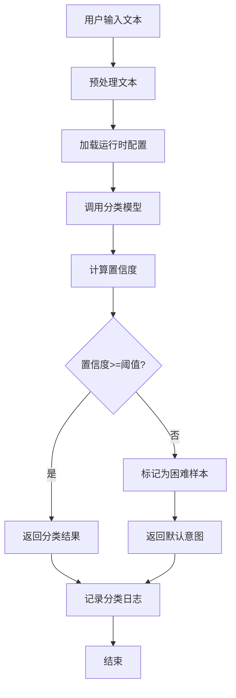
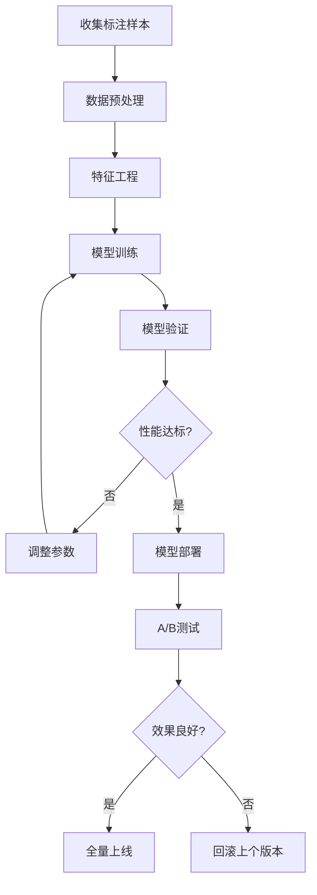
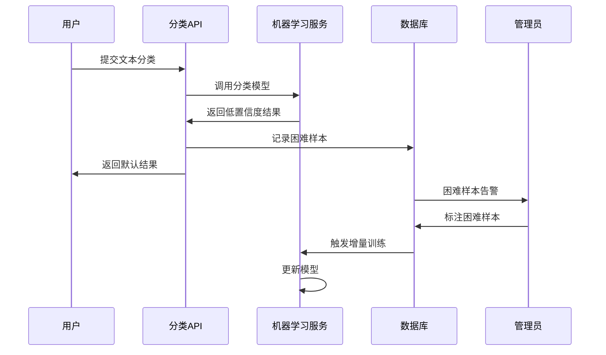

# 意图识别模块

## 模块概述

意图识别模块是SmartCS Web平台的智能分析模块，负责分析用户输入的文本内容，准确识别用户意图，为后续的业务处理提供决策依据。该模块支持多渠道、多租户的意图分类服务，具备在线学习、困难样本上报、运行时配置等高级功能。

## 核心能力

### 1. 意图分类服务
- **实时分类**: 提供低延迟的实时意图分类服务
- **批量分类**: 支持大批量文本的并行意图分类
- **多渠道支持**: 支持不同业务渠道的意图分类模型
- **多租户隔离**: 支持多租户的意图模型隔离和定制

### 2. 模型管理
- **模型训练**: 支持基于标注数据的模型训练
- **模型评估**: 提供模型性能评估和质量监控
- **模型部署**: 支持模型的热更新和版本管理
- **A/B测试**: 支持多模型版本的A/B测试

### 3. 运行时配置
- **动态配置**: 支持运行时参数的动态调整
- **策略配置**: 支持不同场景的分类策略配置
- **阈值调整**: 支持分类置信度阈值的动态调整
- **规则引擎**: 支持基于规则的意图识别增强

### 4. 样本管理
- **标注样本**: 支持训练样本的管理和标注
- **困难样本**: 支持线上困难样本的自动收集
- **样本审核**: 提供样本质量审核和清洗功能
- **增量学习**: 支持基于新样本的模型增量更新

### 5. 意图快照
- **版本管理**: 支持意图配置的版本快照管理
- **回滚机制**: 支持配置变更的快速回滚
- **变更追踪**: 提供配置变更的审计和追踪
- **环境隔离**: 支持开发、测试、生产环境的配置隔离

## 核心实体

### Intent（意图实体）
```java
@Data @Builder
public class Intent {
    private Long id;              // 意图ID
    private String code;          // 意图编码
    private String name;          // 意图名称
    private String description;   // 意图描述
    private String channel;       // 业务渠道
    private String tenant;        // 租户ID
    private IntentStatus status;  // 意图状态
    private Double threshold;     // 分类阈值
    private Integer priority;     // 优先级
    private Long parentId;        // 父意图ID（层次化意图）
    private Long createdAt;       // 创建时间
    private Long updatedAt;       // 更新时间
}
```

### IntentSample（意图样本实体）
```java
@Data @Builder
public class IntentSample {
    private Long id;              // 样本ID
    private Long intentId;        // 意图ID
    private String text;          // 样本文本
    private String channel;       // 业务渠道
    private String tenant;        // 租户ID
    private SampleType type;      // 样本类型
    private SampleStatus status;  // 样本状态
    private Double confidence;    // 置信度
    private String source;        // 样本来源
    private Long createdAt;       // 创建时间
}
```

### IntentClassifyResult（分类结果实体）
```java
@Data @Builder
public class IntentClassifyResult {
    private String intentCode;    // 识别的意图编码
    private String intentName;    // 意图名称
    private Double confidence;    // 置信度分数
    private Boolean isConfident;  // 是否置信
    private List<IntentCandidate> candidates; // 候选意图列表
    private Map<String, Object> metadata; // 扩展元数据
    private Long processTime;     // 处理耗时
}
```

### 枚举定义

#### IntentStatus（意图状态）
- `ACTIVE`: 激活状态，参与分类
- `INACTIVE`: 未激活状态，不参与分类
- `TRAINING`: 训练中状态
- `DEPRECATED`: 已废弃状态

#### SampleType（样本类型）
- `TRAIN`: 训练样本
- `TEST`: 测试样本
- `HARD`: 困难样本
- `FEEDBACK`: 反馈样本

#### SampleStatus（样本状态）
- `PENDING`: 待标注
- `LABELED`: 已标注
- `REVIEWED`: 已审核
- `REJECTED`: 已拒绝

## API接口

### 意图分类接口

#### 运行时分类接口
```
POST   /api/intent/classify                # 单个文本意图分类
POST   /api/intent/classify/batch          # 批量文本意图分类
GET    /api/intent/runtime-config          # 获取运行时配置
POST   /api/intent/report-hard-sample      # 上报困难样本
```

#### 健康检查接口
```
GET    /api/intent/health                  # 服务健康检查
GET    /api/intent/info                    # 服务信息查询
```

### 意图管理接口

#### 管理端意图接口
```
POST   /api/admin/intent                   # 创建意图
PUT    /api/admin/intent                   # 更新意图
GET    /api/admin/intent/{id}              # 获取意图详情
DELETE /api/admin/intent/{id}              # 删除意图
GET    /api/admin/intent                   # 分页查询意图列表
PUT    /api/admin/intent/{id}/status       # 更新意图状态
```

#### 样本管理接口
```
POST   /api/admin/intent/samples           # 创建意图样本
PUT    /api/admin/intent/samples/{id}      # 更新样本
DELETE /api/admin/intent/samples/{id}      # 删除样本
GET    /api/admin/intent/samples           # 查询样本列表
POST   /api/admin/intent/samples/batch     # 批量导入样本
```

### 快照管理接口

#### 意图快照接口
```
POST   /api/admin/intent/snapshots         # 创建意图快照
GET    /api/admin/intent/snapshots/{id}    # 获取快照详情
GET    /api/admin/intent/snapshots         # 查询快照列表
POST   /api/admin/intent/snapshots/{id}/restore # 恢复快照
DELETE /api/admin/intent/snapshots/{id}    # 删除快照
```

### 运行时配置接口
```
GET    /api/intent/runtime                 # 获取运行时状态
PUT    /api/admin/intent/runtime/config    # 更新运行时配置
POST   /api/admin/intent/runtime/reload    # 重新加载配置
```

## 数据模型

### 数据库表结构

#### intent_classification（意图分类表）
```sql
CREATE TABLE intent_classification (
    id          BIGINT PRIMARY KEY AUTO_INCREMENT,
    code        VARCHAR(128) UNIQUE NOT NULL,
    name        VARCHAR(256) NOT NULL,
    description TEXT,
    channel     VARCHAR(64) NOT NULL,
    tenant      VARCHAR(64) NOT NULL,
    status      VARCHAR(32) DEFAULT 'ACTIVE',
    threshold   DECIMAL(5,4) DEFAULT 0.5,
    priority    INT DEFAULT 0,
    parent_id   BIGINT,
    created_at  BIGINT NOT NULL,
    updated_at  BIGINT NOT NULL,
    INDEX idx_channel_tenant (channel, tenant),
    INDEX idx_status (status),
    INDEX idx_parent_id (parent_id)
);
```

#### intent_sample（意图样本表）
```sql
CREATE TABLE intent_sample (
    id         BIGINT PRIMARY KEY AUTO_INCREMENT,
    intent_id  BIGINT NOT NULL,
    text       TEXT NOT NULL,
    channel    VARCHAR(64) NOT NULL,
    tenant     VARCHAR(64) NOT NULL,
    type       VARCHAR(32) NOT NULL,
    status     VARCHAR(32) DEFAULT 'PENDING',
    confidence DECIMAL(5,4),
    source     VARCHAR(128),
    created_at BIGINT NOT NULL,
    updated_at BIGINT NOT NULL,
    INDEX idx_intent_id (intent_id),
    INDEX idx_channel_tenant_type (channel, tenant, type),
    INDEX idx_status (status),
    FULLTEXT idx_text (text)
);
```

#### intent_snapshot（意图快照表）
```sql
CREATE TABLE intent_snapshot (
    id          BIGINT PRIMARY KEY AUTO_INCREMENT,
    name        VARCHAR(256) NOT NULL,
    description TEXT,
    channel     VARCHAR(64) NOT NULL,
    tenant      VARCHAR(64) NOT NULL,
    config_data JSON NOT NULL,
    version     VARCHAR(64),
    created_by  VARCHAR(128),
    created_at  BIGINT NOT NULL,
    INDEX idx_channel_tenant (channel, tenant),
    INDEX idx_version (version)
);
```

## 业务流程

### 1. 意图分类流程



### 2. 模型训练流程



### 3. 困难样本处理流程



## 技术实现

### 1. 核心技术栈
- **LangChain4j**: 文本处理和分类
- **Scikit-learn/TensorFlow**: 机器学习模型
- **Redis**: 模型缓存和配置缓存
- **Spring AI**: AI模型集成
- **Elasticsearch**: 样本检索和分析

### 2. 关键组件

#### IntentClassificationService（意图分类服务）
```java
@Service
public class IntentClassificationService {
    
    @Autowired
    private IntentClassifier classifier;
    
    @Autowired
    private RuntimeConfigService configService;
    
    public SingleResponse<IntentClassifyResponseDTO> classify(IntentClassifyCmd cmd) {
        // 获取运行时配置
        IntentRuntimeConfig config = configService.getConfig(cmd.getChannel(), cmd.getTenant());
        
        // 文本预处理
        String processedText = textProcessor.preprocess(cmd.getText());
        
        // 调用分类器
        IntentClassifyResult result = classifier.classify(processedText, config);
        
        // 检查置信度
        if (result.getConfidence() < config.getThreshold()) {
            // 记录困难样本
            recordHardSample(cmd, result);
            return buildLowConfidenceResponse(result);
        }
        
        return buildSuccessResponse(result);
    }
    
    public SingleResponse<IntentBatchClassifyResponseDTO> batchClassify(IntentBatchClassifyCmd cmd) {
        List<IntentClassifyResult> results = Arrays.stream(cmd.getTexts())
            .parallel()
            .map(text -> classifier.classify(text, getConfig(cmd)))
            .collect(Collectors.toList());
            
        return SingleResponse.of(IntentBatchClassifyResponseDTO.builder()
            .results(results)
            .totalCount(results.size())
            .processTime(System.currentTimeMillis() - startTime)
            .build());
    }
}
```

#### IntentClassifier（意图分类器）
```java
@Component
public class IntentClassifier {
    
    @Autowired
    private ChatLanguageModel chatModel;
    
    @Autowired
    private VectorStore vectorStore;
    
    public IntentClassifyResult classify(String text, IntentRuntimeConfig config) {
        // 构建分类Prompt
        String prompt = buildClassificationPrompt(text, config.getIntents());
        
        // 调用LLM进行分类
        String response = chatModel.generate(prompt);
        
        // 解析分类结果
        IntentClassifyResult result = parseClassificationResult(response);
        
        // 计算置信度
        result.setConfidence(calculateConfidence(text, result.getIntentCode()));
        
        return result;
    }
    
    private String buildClassificationPrompt(String text, List<Intent> intents) {
        StringBuilder promptBuilder = new StringBuilder();
        promptBuilder.append("请分析以下用户输入的意图：\n");
        promptBuilder.append("用户输入：").append(text).append("\n");
        promptBuilder.append("可选意图：\n");
        
        for (Intent intent : intents) {
            promptBuilder.append("- ").append(intent.getCode())
                .append("(").append(intent.getName()).append("): ")
                .append(intent.getDescription()).append("\n");
        }
        
        promptBuilder.append("\n请返回最匹配的意图编码和置信度分数(0-1)，格式：{\"intent\":\"编码\",\"confidence\":0.95}");
        
        return promptBuilder.toString();
    }
}
```

#### RuntimeConfigService（运行时配置服务）
```java
@Service
public class RuntimeConfigService {
    
    @Autowired
    private RedisTemplate<String, Object> redisTemplate;
    
    @Autowired
    private IntentGateway intentGateway;
    
    public IntentRuntimeConfig getConfig(String channel, String tenant) {
        String cacheKey = String.format("intent:config:%s:%s", channel, tenant);
        
        // 尝试从缓存获取
        IntentRuntimeConfig config = (IntentRuntimeConfig) redisTemplate.opsForValue().get(cacheKey);
        
        if (config == null) {
            // 从数据库加载配置
            config = loadConfigFromDatabase(channel, tenant);
            
            // 缓存配置
            redisTemplate.opsForValue().set(cacheKey, config, Duration.ofMinutes(30));
        }
        
        return config;
    }
    
    public void reloadConfig(String channel, String tenant) {
        String cacheKey = String.format("intent:config:%s:%s", channel, tenant);
        redisTemplate.delete(cacheKey);
        
        // 预热缓存
        getConfig(channel, tenant);
    }
    
    private IntentRuntimeConfig loadConfigFromDatabase(String channel, String tenant) {
        List<Intent> intents = intentGateway.getActiveIntents(channel, tenant);
        
        return IntentRuntimeConfig.builder()
            .channel(channel)
            .tenant(tenant)
            .intents(intents)
            .threshold(0.7)
            .maxCandidates(5)
            .cacheEnabled(true)
            .build();
    }
}
```

### 3. 困难样本处理

#### HardSampleCollector（困难样本收集器）
```java
@Component
public class HardSampleCollector {
    
    @Autowired
    private IntentSampleGateway sampleGateway;
    
    @Autowired
    private ApplicationEventPublisher eventPublisher;
    
    public void collectHardSample(IntentClassifyCmd cmd, IntentClassifyResult result) {
        IntentSample sample = IntentSample.builder()
            .text(cmd.getText())
            .channel(cmd.getChannel())
            .tenant(cmd.getTenant())
            .type(SampleType.HARD)
            .status(SampleStatus.PENDING)
            .confidence(result.getConfidence())
            .source("runtime_classification")
            .createdAt(System.currentTimeMillis())
            .build();
        
        // 保存困难样本
        sampleGateway.save(sample);
        
        // 发布困难样本事件
        eventPublisher.publishEvent(new HardSampleCollectedEvent(sample));
    }
    
    @EventListener
    public void handleHardSample(HardSampleCollectedEvent event) {
        IntentSample sample = event.getSample();
        
        // 统计困难样本
        updateHardSampleStats(sample);
        
        // 触发告警
        if (shouldTriggerAlert(sample)) {
            alertService.sendHardSampleAlert(sample);
        }
        
        // 自动标注（如果有规则）
        tryAutoLabel(sample);
    }
}
```

### 4. 意图快照管理

#### IntentSnapshotService（快照服务）
```java
@Service
public class IntentSnapshotService {
    
    @Autowired
    private IntentSnapshotGateway snapshotGateway;
    
    @Autowired
    private IntentGateway intentGateway;
    
    public SingleResponse<IntentSnapshotDTO> createSnapshot(IntentSnapshotCreateCmd cmd) {
        // 获取当前意图配置
        List<Intent> currentIntents = intentGateway.getIntentsByChannel(cmd.getChannel(), cmd.getTenant());
        
        // 构建快照数据
        Map<String, Object> configData = new HashMap<>();
        configData.put("intents", currentIntents);
        configData.put("timestamp", System.currentTimeMillis());
        configData.put("version", generateVersion());
        
        // 创建快照
        IntentSnapshot snapshot = IntentSnapshot.builder()
            .name(cmd.getName())
            .description(cmd.getDescription())
            .channel(cmd.getChannel())
            .tenant(cmd.getTenant())
            .configData(configData)
            .version((String) configData.get("version"))
            .createdBy(cmd.getCreatedBy())
            .createdAt(System.currentTimeMillis())
            .build();
        
        IntentSnapshot saved = snapshotGateway.save(snapshot);
        
        return SingleResponse.of(IntentSnapshotConvertor.toDTO(saved));
    }
    
    public Response restoreSnapshot(Long snapshotId) {
        IntentSnapshot snapshot = snapshotGateway.findById(snapshotId);
        if (snapshot == null) {
            return Response.buildFailure("SNAPSHOT_NOT_FOUND", "快照不存在");
        }
        
        // 解析快照数据
        Map<String, Object> configData = snapshot.getConfigData();
        List<Intent> intents = (List<Intent>) configData.get("intents");
        
        // 备份当前配置
        createSnapshot(IntentSnapshotCreateCmd.builder()
            .name("Auto backup before restore")
            .channel(snapshot.getChannel())
            .tenant(snapshot.getTenant())
            .createdBy("system")
            .build());
        
        // 恢复意图配置
        intentGateway.batchUpdate(intents);
        
        // 清除缓存
        runtimeConfigService.reloadConfig(snapshot.getChannel(), snapshot.getTenant());
        
        return Response.buildSuccess();
    }
}
```

## 性能优化

### 1. 分类性能优化
- **模型缓存**: 分类模型的内存缓存
- **批量处理**: 批量文本的并行分类
- **结果缓存**: 相同文本分类结果缓存
- **异步处理**: 非核心流程异步处理

### 2. 配置加载优化
- **多级缓存**: Redis + 本地缓存的多级缓存
- **配置预热**: 系统启动时预加载热点配置
- **增量更新**: 配置变更的增量推送
- **懒加载**: 按需加载非活跃配置

### 3. 样本处理优化
- **异步收集**: 困难样本的异步收集和处理
- **批量入库**: 样本数据的批量插入
- **定期清理**: 过期样本的定期清理
- **智能采样**: 基于规则的智能样本采样

## 扩展点

### 1. 多模型支持
- 支持多种分类算法（深度学习、传统ML）
- 模型融合和集成学习
- 模型效果对比和选择

### 2. 高级功能
- 层次化意图识别
- 多意图识别
- 意图置信度校准

### 3. 企业功能
- 意图分析报表
- 模型性能监控
- 分类审计日志

## 相关模块

- **AI应用模块**: 为AI应用提供意图识别能力
- **智能聊天模块**: 提供对话意图分析
- **RAG检索模块**: 提供意图感知的检索
- **用户管理模块**: 提供多租户隔离

## 文件路径

### 核心文件
- **Controller**: `/smartcs-web-adapter/src/main/java/com/leyue/smartcs/web/intent/`
- **Domain**: `/smartcs-web-domain/src/main/java/com/leyue/smartcs/domain/intent/`
- **App Service**: `/smartcs-web-app/src/main/java/com/leyue/smartcs/intent/executor/`
- **Infrastructure**: `/smartcs-web-infrastructure/src/main/java/com/leyue/smartcs/intent/`
- **Client DTO**: `/smartcs-web-client/src/main/java/com/leyue/smartcs/dto/intent/`