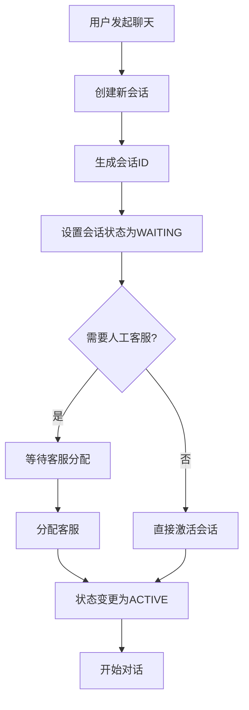
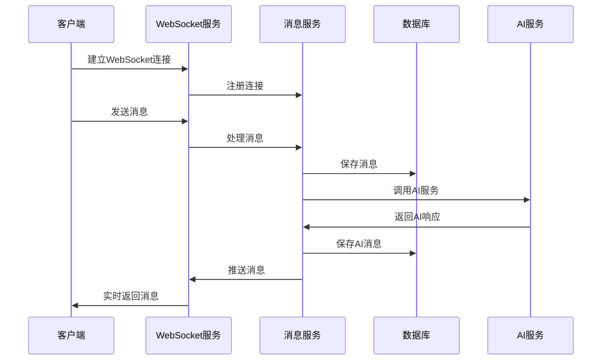
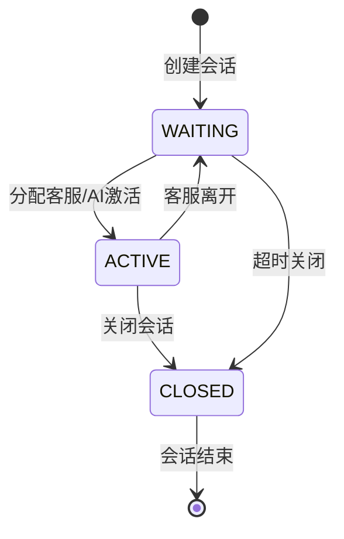

# 智能聊天模块

## 模块概述

智能聊天模块是SmartCS Web平台的核心交互模块，负责提供完整的对话服务能力，包括会话管理、消息处理、实时通信和会话状态管理。该模块支持WebSocket实时通信、SSE流式响应，并基于Spring State Machine实现复杂的会话状态流转。

## 核心能力

### 1. 会话管理
- **会话生命周期**: 创建、活跃、等待、关闭的完整状态管理
- **会话持久化**: 支持会话信息的持久化存储和恢复
- **会话分配**: 智能的客服-客户会话分配机制
- **会话统计**: 提供会话时长、消息数量等统计功能

### 2. 消息处理
- **多类型消息**: 支持文本、图片、文件等多种消息类型
- **消息持久化**: 基于水平分片的高性能消息存储
- **消息检索**: 支持按会话、时间、关键词等维度检索
- **消息审核**: 集成内容审核机制保障消息安全

### 3. 实时通信
- **WebSocket连接**: 支持全双工实时通信
- **SSE流式响应**: 支持服务器推送的流式消息
- **连接管理**: 智能的连接池和心跳保活机制
- **消息广播**: 支持一对一、一对多的消息分发

### 4. 状态机管理
- **会话状态**: 基于Spring State Machine的状态流转
- **事件驱动**: 支持状态变更事件的监听和处理
- **自动流转**: 支持基于规则的自动状态流转

## 核心实体

### Session（会话实体）
```java
@Data
public class Session {
    private Long id;              // 主键ID
    private Long sessionId;       // 会话ID
    private String sessionName;   // 会话名称
    private Long customerId;      // 客户ID
    private Long agentId;         // 客服ID
    private String agentName;     // 客服名称
    private SessionState sessionState; // 会话状态
    private String closeReason;   // 关闭原因
    private String lastMessage;   // 最后消息内容
    private Long lastMsgTime;     // 最后消息时间
    private Long createdAt;       // 创建时间
}
```

### Message（消息实体）
```java
@Data
public class Message {
    private Long id;              // 消息ID
    private Long sessionId;       // 会话ID
    private String content;       // 消息内容
    private SenderRole senderRole; // 发送者角色
    private MessageType messageType; // 消息类型
    private String metadata;      // 消息元数据
    private Long timestamp;       // 消息时间戳
}
```

### 枚举定义

#### SessionState（会话状态）
- `WAITING`: 等待分配客服
- `ACTIVE`: 会话进行中
- `CLOSED`: 会话已关闭

#### SessionEvent（会话事件）
- `ASSIGN`: 分配客服
- `START`: 开始对话
- `CLOSE`: 关闭会话

#### SenderRole（发送者角色）
- `USER`: 用户/客户
- `ASSISTANT`: AI助手
- `AGENT`: 人工客服

#### MessageType（消息类型）
- `TEXT`: 文本消息
- `IMAGE`: 图片消息
- `FILE`: 文件消息
- `SYSTEM`: 系统消息

## API接口

### 会话管理接口

#### 管理端会话接口
```
POST   /api/admin/chat/sessions           # 创建会话
GET    /api/admin/chat/sessions/{id}      # 获取会话详情
PUT    /api/admin/chat/sessions/{id}/name # 更新会话名称
DELETE /api/admin/chat/sessions/{id}      # 删除会话
GET    /api/admin/chat/sessions           # 分页查询会话列表
```

#### 客户端会话接口
```
POST   /api/chat/sessions                 # 创建会话
GET    /api/chat/sessions/{id}            # 获取会话详情
PUT    /api/chat/sessions/{id}/name       # 更新会话名称
GET    /api/chat/sessions                 # 获取用户会话列表
```

### 消息管理接口

#### 消息查询接口
```
GET    /api/chat/messages/session/{sessionId}      # 获取会话消息历史
GET    /api/chat/messages/session/{sessionId}/page # 分页获取会话消息
```

#### 管理端消息接口
```
GET    /api/admin/chat/messages/session/{sessionId} # 管理端获取消息
DELETE /api/admin/chat/messages/{id}                # 删除消息
```

### WebSocket接口
```
WebSocket: /ws/chat/{sessionId}           # 建立WebSocket连接
```

## 数据模型

### 数据库表结构

#### chat_session（会话表）
```sql
CREATE TABLE chat_session (
    id           BIGINT PRIMARY KEY AUTO_INCREMENT,
    session_id   BIGINT UNIQUE NOT NULL,
    session_name VARCHAR(256),
    customer_id  BIGINT,
    agent_id     BIGINT,
    agent_name   VARCHAR(128),
    session_state VARCHAR(32) NOT NULL,
    close_reason VARCHAR(512),
    last_message TEXT,
    last_msg_time BIGINT,
    created_at   BIGINT NOT NULL,
    INDEX idx_customer_id (customer_id),
    INDEX idx_agent_id (agent_id),
    INDEX idx_session_state (session_state)
);
```

#### chat_message_yyyymm（消息分片表）
```sql
CREATE TABLE chat_message_202409 (
    id          BIGINT PRIMARY KEY AUTO_INCREMENT,
    session_id  BIGINT NOT NULL,
    content     LONGTEXT NOT NULL,
    sender_role VARCHAR(32) NOT NULL,
    message_type VARCHAR(32) NOT NULL,
    metadata    JSON,
    timestamp   BIGINT NOT NULL,
    INDEX idx_session_timestamp (session_id, timestamp),
    INDEX idx_timestamp (timestamp)
);
```

## 业务流程

### 1. 会话创建流程



### 2. 实时通信流程



### 3. 会话状态流转



## 技术实现

### 1. 核心技术栈
- **Spring State Machine**: 会话状态管理
- **WebSocket**: 实时双向通信
- **SSE**: 服务器推送事件
- **Redis**: 会话状态缓存和消息队列
- **MyBatis-Plus**: 数据持久化
- **水平分表**: 高性能消息存储

### 2. 关键组件

#### ChatWebSocketController（WebSocket控制器）
```java
@Controller
@RequestMapping("/ws/chat")
public class ChatWebSocketController {
    
    @MessageMapping("/session/{sessionId}")
    @SendTo("/topic/session/{sessionId}")
    public MessageVO handleMessage(
        @DestinationVariable Long sessionId,
        MessageDTO message
    ) {
        // 处理WebSocket消息
        return messageService.processMessage(sessionId, message);
    }
}
```

#### SessionDomainService（会话领域服务）
```java
@Service
public class SessionDomainService {
    
    @Autowired
    private StateMachine<SessionState, SessionEvent> stateMachine;
    
    public void transitionState(Long sessionId, SessionEvent event) {
        // 状态机驱动的会话状态流转
        stateMachine.sendEvent(event);
    }
}
```

#### MessageDomainService（消息领域服务）
```java
@Service
public class MessageDomainService {
    
    public Message createMessage(Long sessionId, String content, SenderRole role) {
        // 创建消息并进行内容审核
        Message message = Message.builder()
            .sessionId(sessionId)
            .content(content)
            .senderRole(role)
            .timestamp(System.currentTimeMillis())
            .build();
            
        // 内容审核
        moderationService.moderate(message);
        
        return message;
    }
}
```

### 3. 水平分表策略

#### 分表规则
- 按月分表：`chat_message_yyyymm`
- 分表键：`timestamp`
- 路由策略：根据消息时间戳路由到对应月份表

#### 分表实现
```java
@Component
public class MessageTableShardingStrategy {
    
    public String getTableName(Long timestamp) {
        LocalDate date = Instant.ofEpochMilli(timestamp)
            .atZone(ZoneId.systemDefault())
            .toLocalDate();
        return "chat_message_" + date.format(DateTimeFormatter.ofPattern("yyyyMM"));
    }
}
```

### 4. WebSocket连接管理

#### 连接池管理
```java
@Component
public class WebSocketConnectionManager {
    
    private final Map<Long, Set<WebSocketSession>> sessionConnections = 
        new ConcurrentHashMap<>();
    
    public void addConnection(Long sessionId, WebSocketSession wsSession) {
        sessionConnections.computeIfAbsent(sessionId, k -> ConcurrentHashMap.newKeySet())
            .add(wsSession);
    }
    
    public void broadcastToSession(Long sessionId, Object message) {
        Set<WebSocketSession> connections = sessionConnections.get(sessionId);
        if (connections != null) {
            connections.forEach(session -> {
                try {
                    session.sendMessage(new TextMessage(JSON.toJSONString(message)));
                } catch (IOException e) {
                    log.error("发送WebSocket消息失败", e);
                }
            });
        }
    }
}
```

## 性能优化

### 1. 消息存储优化
- **水平分表**: 按时间维度分表，提升查询性能
- **索引优化**: 针对常用查询场景建立复合索引
- **冷热数据分离**: 历史消息归档到冷存储

### 2. 实时通信优化
- **连接池管理**: 智能的连接复用和释放
- **消息批处理**: 高频消息的批量处理
- **心跳保活**: 智能的连接保活机制

### 3. 缓存策略
- **会话缓存**: 活跃会话信息缓存到Redis
- **消息缓存**: 最近消息缓存，提升历史查询性能
- **状态缓存**: 会话状态缓存，减少数据库查询

## 扩展点

### 1. 多渠道接入
- 支持微信、QQ、钉钉等多渠道
- 统一的消息格式和处理流程
- 渠道特定的消息类型适配

### 2. 智能路由
- 基于技能的客服路由
- 负载均衡的客服分配
- VIP客户优先级处理

### 3. 监控和分析
- 会话质量评估
- 响应时间监控
- 客户满意度统计

## 相关模块

- **AI应用模块**: 提供AI对话能力
- **意图识别模块**: 提供用户意图分析
- **内容审核模块**: 提供消息内容审核
- **用户管理模块**: 提供用户认证和权限

## 文件路径

### 核心文件
- **Controller**: `/smartcs-web-adapter/src/main/java/com/leyue/smartcs/web/message/`
- **WebSocket**: `/smartcs-web-adapter/src/main/java/com/leyue/smartcs/websocket/`
- **Domain**: `/smartcs-web-domain/src/main/java/com/leyue/smartcs/domain/chat/`
- **App Service**: `/smartcs-web-app/src/main/java/com/leyue/smartcs/chat/executor/`
- **Infrastructure**: `/smartcs-web-infrastructure/src/main/java/com/leyue/smartcs/chat/`
- **State Machine**: `/smartcs-web-app/src/main/java/com/leyue/smartcs/statemachine/`