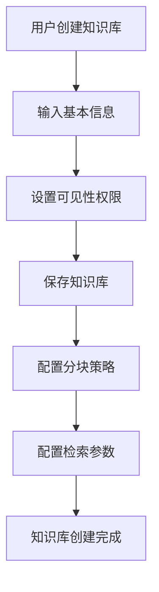
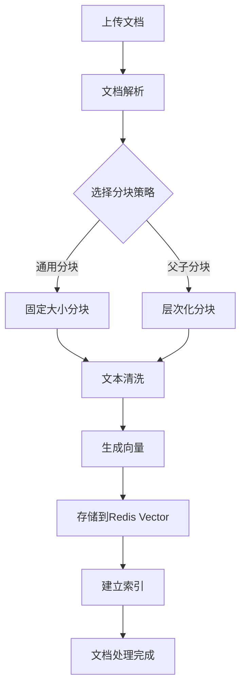
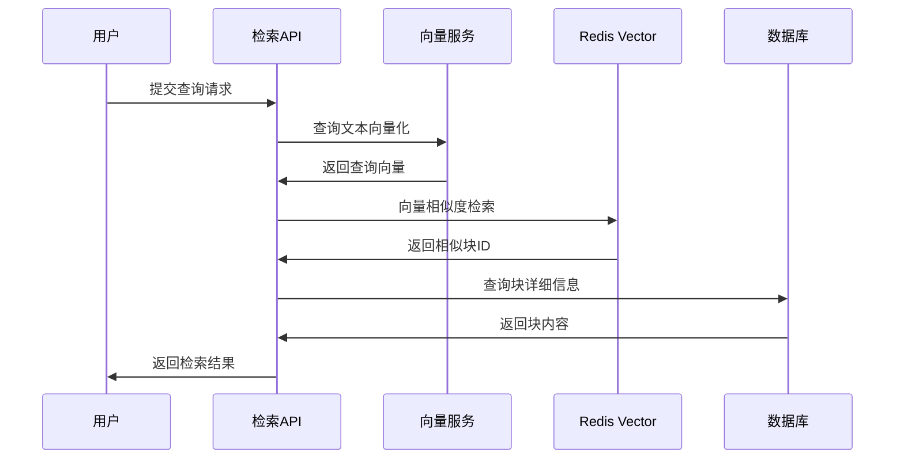

# 知识库管理模块

## 模块概述

知识库管理模块是SmartCS Web平台的核心知识服务模块，负责知识的采集、处理、存储、检索和管理。该模块支持多种文档格式，提供智能分块、向量化存储、语义检索等功能，为AI应用提供强大的知识支撑能力。

## 核心能力

### 1. 知识库生命周期管理
- **知识库创建**: 支持创建私有和公开知识库
- **知识库配置**: 提供丰富的知识库参数配置
- **权限管理**: 支持基于角色的知识库访问控制
- **版本管理**: 支持知识库内容的版本控制和回滚

### 2. 文档处理能力
- **多格式支持**: 支持PDF、Word、TXT、Markdown等格式
- **智能分块**: 提供通用分块和父子分块两种策略
- **内容提取**: 智能提取文档中的文本、图片、表格信息
- **内容清洗**: 自动去除冗余信息，提升内容质量

### 3. 向量化存储
- **文本向量化**: 基于Embedding模型生成文本向量
- **向量存储**: 使用Redis Vector作为向量数据库
- **索引管理**: 支持向量索引的创建、更新和删除
- **相似度计算**: 支持余弦相似度、欧几里得距离等计算方式

### 4. 智能检索
- **语义检索**: 基于向量相似度的语义检索
- **混合检索**: 结合关键词和语义检索的混合模式
- **召回测试**: 提供检索效果的测试和评估工具
- **检索优化**: 支持检索参数的动态调整和优化

### 5. 内容管理
- **内容审核**: 集成内容审核机制保障知识质量
- **状态管理**: 支持内容的发布、下架、删除等状态管理
- **分类标签**: 支持知识内容的分类和标签管理
- **质量评估**: 提供内容质量的自动评估功能

## 核心实体

### KnowledgeBase（知识库实体）
```java
@Data @Builder
public class KnowledgeBase {
    private Long id;              // 主键ID
    private String name;          // 知识库名称
    private String code;          // 知识库唯一编码
    private String description;   // 描述信息
    private Long ownerId;         // 拥有者ID
    private String visibility;    // 可见性(public/private)
    private Long createdBy;       // 创建者ID
    private Long createdAt;       // 创建时间
    private Long updatedAt;       // 更新时间
}
```

### KnowledgeContent（知识内容实体）
```java
@Data @Builder
public class KnowledgeContent {
    private Long id;              // 内容ID
    private Long knowledgeBaseId; // 知识库ID
    private String title;         // 内容标题
    private String content;       // 内容文本
    private String summary;       // 内容摘要
    private ContentType type;     // 内容类型
    private String source;        // 来源信息
    private ContentStatus status; // 内容状态
    private List<String> tags;    // 标签列表
    private Long createdAt;       // 创建时间
}
```

### Chunk（文档块实体）
```java
@Data @Builder
public class Chunk {
    private Long id;              // 块ID
    private Long contentId;       // 内容ID
    private String text;          // 块文本
    private Map<String, Object> metadata; // 元数据
    private Integer position;     // 块位置
    private Long parentId;        // 父块ID(父子分块)
    private float[] embedding;    // 向量表示
}
```

### 枚举定义

#### ContentType（内容类型）
- `DOCUMENT`: 文档类型
- `FAQ`: 常见问题
- `SNIPPET`: 代码片段
- `IMAGE`: 图片内容

#### ContentStatus（内容状态）
- `DRAFT`: 草稿状态
- `PUBLISHED`: 已发布
- `ARCHIVED`: 已归档
- `DELETED`: 已删除

#### ChunkingStrategy（分块策略）
- `GENERAL`: 通用分块策略
- `PARENT_CHILD`: 父子分块策略

## API接口

### 知识库管理接口

#### 管理端知识库接口
```
POST   /api/admin/knowledge-base          # 创建知识库
PUT    /api/admin/knowledge-base          # 更新知识库
GET    /api/admin/knowledge-base/{id}     # 获取知识库详情
DELETE /api/admin/knowledge-base/{id}     # 删除知识库
GET    /api/admin/knowledge-base          # 分页查询知识库列表
```

#### 知识库配置接口
```
GET    /api/admin/knowledge-base/{id}/settings    # 获取知识库设置
PUT    /api/admin/knowledge-base/{id}/settings    # 更新知识库设置
```

#### 文档检索接口
```
POST   /api/admin/knowledge-base/search/text      # 文本检索
POST   /api/admin/knowledge-base/{id}/recall-test # 召回测试
```

### 文档处理接口

#### 文档分块接口
```
POST   /api/admin/knowledge-base/chunk/general      # 通用文档分块
POST   /api/admin/knowledge-base/chunk/parent-child # 父子文档分块
```

### 内容管理接口

#### 知识内容接口
```
POST   /api/admin/knowledge-content          # 创建知识内容
PUT    /api/admin/knowledge-content          # 更新知识内容
GET    /api/admin/knowledge-content/{id}     # 获取内容详情
DELETE /api/admin/knowledge-content/{id}     # 删除内容
GET    /api/admin/knowledge-content          # 分页查询内容列表
```

#### 内容块管理接口
```
GET    /api/admin/chunks                     # 查询内容块
PUT    /api/admin/chunks/{id}                # 更新内容块
DELETE /api/admin/chunks/{id}                # 删除内容块
```

## 数据模型

### 数据库表结构

#### knowledge_base（知识库表）
```sql
CREATE TABLE knowledge_base (
    id          BIGINT PRIMARY KEY AUTO_INCREMENT,
    name        VARCHAR(128) NOT NULL,
    code        VARCHAR(64) UNIQUE NOT NULL,
    description TEXT,
    owner_id    BIGINT NOT NULL,
    visibility  VARCHAR(32) DEFAULT 'private',
    created_by  BIGINT,
    created_at  BIGINT NOT NULL,
    updated_at  BIGINT NOT NULL,
    INDEX idx_owner_id (owner_id),
    INDEX idx_visibility (visibility)
);
```

#### knowledge_content（知识内容表）
```sql
CREATE TABLE knowledge_content (
    id                BIGINT PRIMARY KEY AUTO_INCREMENT,
    knowledge_base_id BIGINT NOT NULL,
    title             VARCHAR(512) NOT NULL,
    content           LONGTEXT NOT NULL,
    summary           TEXT,
    type              VARCHAR(32) NOT NULL,
    source            VARCHAR(1024),
    status            VARCHAR(32) DEFAULT 'draft',
    tags              JSON,
    created_at        BIGINT NOT NULL,
    updated_at        BIGINT NOT NULL,
    INDEX idx_kb_id (knowledge_base_id),
    INDEX idx_type_status (type, status),
    FULLTEXT idx_content (title, content)
);
```

#### content_chunk（内容块表）
```sql
CREATE TABLE content_chunk (
    id         BIGINT PRIMARY KEY AUTO_INCREMENT,
    content_id BIGINT NOT NULL,
    text       LONGTEXT NOT NULL,
    metadata   JSON,
    position   INT NOT NULL,
    parent_id  BIGINT,
    embedding  BLOB,
    created_at BIGINT NOT NULL,
    INDEX idx_content_id (content_id),
    INDEX idx_parent_id (parent_id)
);
```

### Redis Vector索引结构
```
# 向量索引
FT.CREATE knowledge_vector_idx 
    ON HASH PREFIX 1 "vec:" 
    SCHEMA 
        content_id NUMERIC 
        embedding VECTOR FLAT 6 TYPE FLOAT32 DIM 1536 DISTANCE_METRIC COSINE
```

## 业务流程

### 1. 知识库创建流程



### 2. 文档处理流程



### 3. 知识检索流程



## 技术实现

### 1. 核心技术栈
- **LangChain4j**: 文档处理和向量化
- **Redis Vector**: 向量存储和检索
- **Apache Tika**: 文档格式解析
- **OpenAI Embeddings**: 文本向量化模型
- **Spring Batch**: 批处理任务

### 2. 关键组件

#### KnowledgeBaseService（知识库服务）
```java
@Service
public class KnowledgeBaseService {
    
    // 知识库管理
    SingleResponse<KnowledgeBaseDTO> createKnowledgeBase(KnowledgeBaseCreateCmd cmd);
    Response updateKnowledgeBase(KnowledgeBaseUpdateCmd cmd);
    
    // 文档检索
    MultiResponse<EmbeddingWithScore> searchByText(KnowledgeSearchQry qry);
    
    // 文档分块
    MultiResponse<ChunkDTO> generalChunk(KnowledgeGeneralChunkCmd cmd);
    MultiResponse<ChunkDTO> parentChildChunk(KnowledgeParentChildChunkCmd cmd);
    
    // 召回测试
    MultiResponse<RecallTestResultDTO> recallTest(RecallTestQry qry);
}
```

#### DocumentProcessor（文档处理器）
```java
@Component
public class DocumentProcessor {
    
    @Autowired
    private EmbeddingModel embeddingModel;
    
    @Autowired
    private TextSplitter textSplitter;
    
    public List<Chunk> processDocument(String content, ChunkingStrategy strategy) {
        // 文档分块
        List<String> chunks = textSplitter.split(content, strategy);
        
        // 向量化
        List<Chunk> result = new ArrayList<>();
        for (int i = 0; i < chunks.size(); i++) {
            String text = chunks.get(i);
            float[] embedding = embeddingModel.embed(text);
            
            Chunk chunk = Chunk.builder()
                .text(text)
                .position(i)
                .embedding(embedding)
                .build();
            result.add(chunk);
        }
        
        return result;
    }
}
```

#### VectorSearchService（向量检索服务）
```java
@Service
public class VectorSearchService {
    
    @Autowired
    private RedisTemplate<String, Object> redisTemplate;
    
    @Autowired
    private EmbeddingModel embeddingModel;
    
    public List<SearchResult> search(String query, int topK, float threshold) {
        // 查询向量化
        float[] queryEmbedding = embeddingModel.embed(query);
        
        // Redis Vector检索
        String vectorQuery = String.format(
            "FT.SEARCH knowledge_vector_idx \"*=>[KNN %d @embedding $query_vector AS score]\" " +
            "PARAMS 2 query_vector %s SORTBY score LIMIT 0 %d",
            topK, encodeVector(queryEmbedding), topK
        );
        
        List<Object> results = redisTemplate.execute((RedisCallback<List<Object>>) connection -> {
            return connection.execute("FT.SEARCH", vectorQuery.split(" "));
        });
        
        return parseSearchResults(results, threshold);
    }
}
```

### 3. 分块策略实现

#### GeneralChunkingStrategy（通用分块策略）
```java
@Component
public class GeneralChunkingStrategy implements ChunkingStrategy {
    
    private static final int DEFAULT_CHUNK_SIZE = 1000;
    private static final int DEFAULT_OVERLAP = 200;
    
    @Override
    public List<String> chunk(String text) {
        List<String> chunks = new ArrayList<>();
        int start = 0;
        
        while (start < text.length()) {
            int end = Math.min(start + DEFAULT_CHUNK_SIZE, text.length());
            String chunk = text.substring(start, end);
            chunks.add(chunk);
            start += DEFAULT_CHUNK_SIZE - DEFAULT_OVERLAP;
        }
        
        return chunks;
    }
}
```

#### ParentChildChunkingStrategy（父子分块策略）
```java
@Component
public class ParentChildChunkingStrategy implements ChunkingStrategy {
    
    private static final int PARENT_CHUNK_SIZE = 2000;
    private static final int CHILD_CHUNK_SIZE = 500;
    
    @Override
    public List<Chunk> chunkWithHierarchy(String text) {
        List<Chunk> result = new ArrayList<>();
        
        // 生成父块
        List<String> parentTexts = splitBySize(text, PARENT_CHUNK_SIZE);
        
        for (int i = 0; i < parentTexts.size(); i++) {
            String parentText = parentTexts.get(i);
            
            // 创建父块
            Chunk parent = Chunk.builder()
                .text(parentText)
                .position(i)
                .parentId(null)
                .build();
            result.add(parent);
            
            // 生成子块
            List<String> childTexts = splitBySize(parentText, CHILD_CHUNK_SIZE);
            for (int j = 0; j < childTexts.size(); j++) {
                Chunk child = Chunk.builder()
                    .text(childTexts.get(j))
                    .position(j)
                    .parentId(parent.getId())
                    .build();
                result.add(child);
            }
        }
        
        return result;
    }
}
```

### 4. 召回测试功能

#### RecallTestService（召回测试服务）
```java
@Service
public class RecallTestService {
    
    public RecallTestResult testRecall(String query, List<String> expectedDocs) {
        // 执行检索
        List<SearchResult> searchResults = vectorSearchService.search(query, 20, 0.5f);
        
        // 计算召回指标
        Set<String> retrievedDocs = searchResults.stream()
            .map(SearchResult::getDocId)
            .collect(Collectors.toSet());
        
        Set<String> expectedSet = new HashSet<>(expectedDocs);
        Set<String> intersect = Sets.intersection(retrievedDocs, expectedSet);
        
        double precision = (double) intersect.size() / retrievedDocs.size();
        double recall = (double) intersect.size() / expectedSet.size();
        double f1Score = 2 * precision * recall / (precision + recall);
        
        return RecallTestResult.builder()
            .precision(precision)
            .recall(recall)
            .f1Score(f1Score)
            .retrievedCount(retrievedDocs.size())
            .expectedCount(expectedSet.size())
            .matchedCount(intersect.size())
            .build();
    }
}
```

## 性能优化

### 1. 检索性能优化
- **向量索引优化**: 使用合适的向量索引算法(HNSW/IVF)
- **缓存策略**: 热点查询结果缓存
- **并行检索**: 多路并行检索提升性能
- **预计算**: 常见查询的预计算和缓存

### 2. 存储优化
- **分层存储**: 热数据使用Redis，冷数据使用HBase
- **压缩算法**: 向量数据的高效压缩存储
- **分片策略**: 大规模知识库的水平分片

### 3. 内存优化
- **懒加载**: 向量数据的按需加载
- **内存池**: 向量计算的内存池复用
- **批处理**: 批量向量计算减少开销

## 扩展点

### 1. 多模态支持
- 图片向量化和检索
- 音频内容的处理和检索
- 视频内容的关键帧提取

### 2. 知识图谱集成
- 实体关系提取
- 知识图谱构建
- 图谱推理检索

### 3. 企业功能
- 知识库访问审计
- 知识质量评估
- 自动标签生成

## 相关模块

- **AI应用模块**: 为AI应用提供知识检索能力
- **RAG检索模块**: 提供检索增强生成能力
- **内容审核模块**: 提供知识内容审核
- **用户管理模块**: 提供知识库权限控制

## 文件路径

### 核心文件
- **Controller**: `/smartcs-web-adapter/src/main/java/com/leyue/smartcs/web/knowledge/`
- **Domain**: `/smartcs-web-domain/src/main/java/com/leyue/smartcs/domain/knowledge/`
- **App Service**: `/smartcs-web-app/src/main/java/com/leyue/smartcs/knowledge/executor/`
- **Infrastructure**: `/smartcs-web-infrastructure/src/main/java/com/leyue/smartcs/knowledge/`
- **Client DTO**: `/smartcs-web-client/src/main/java/com/leyue/smartcs/dto/knowledge/`
- **Chunking**: `/smartcs-web-infrastructure/src/main/java/com/leyue/smartcs/chunking/`