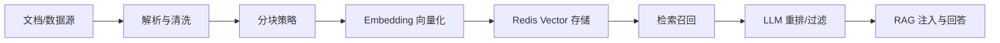

# 知识库管理模块（功能与架构）

本模块是 RAG 的知识底座，聚焦“文档到可检索知识”的全链路：解析 → 分块 → 清洗 → 向量化 → 存储 → 检索与重排。本文淡化接口/类细节，专注能力边界、架构实现与落地实践。

## 能力边界

- 多源文档接入：PDF/Word/TXT/Markdown 等统一解析；可扩展结构化数据（FAQ/表格/配置）。
- 智能分块：按文件类型自适应选择策略，在控制长度的同时尽量保持语义完整。
- 语义向量化与存储：统一 Embedding 模型；Redis Vector 作为主向量库；元数据可审计可追溯。
- 语义检索与重排：TopK/阈值检索 +（可选）LLM 重排序；与 RAG 路由无缝对接。
- 可观测与评估：召回量、时延、上下文利用率可观测；线上采样 + 基准集离线评估。

## 架构实现

实现位置（关键文件）：
- 分块策略封装：`smartcs-web-infrastructure/src/main/java/com/leyue/smartcs/knowledge/chunking/LangChain4jChunkingStrategy.java`
- 文档解析适配：`smartcs-web-infrastructure/src/main/java/com/leyue/smartcs/knowledge/parser/*`
- 向量库配置：`smartcs-web-infrastructure/src/main/java/com/leyue/smartcs/rag/config/RedisEmbeddingStoreConfig.java`
- 批量向量化范式（参考 NL2SQL 的 schema 向量化）：`smartcs-web-infrastructure/src/main/java/com/leyue/smartcs/rag/database/service/TableSchemaVectorizationService.java`
- RAG 组装与检索路由：`smartcs-web-infrastructure/src/main/java/com/leyue/smartcs/rag/factory/RagAugmentorFactory.java`

## 分块策略（实践指引）

分块目标：语义完整 > 长度可控 > 可复用低成本。

- 策略类型：递归/段落/行/句子/词/字符/正则（按文件类型自动推荐）。
- 建议参数：
  - `chunkSize=800~1200`，`overlapSize=150~250`
  - `minChunkSize` 与 `maxChunkSize` 限制极端片段（过小/过大）
- 预处理：
  - 去空白、规范化标点；需要时移除 URL/邮箱
  - 对超长片段二次切分优先选“句尾/自然边界”，避免割裂语义
- 类型建议：
  - Markdown/HTML → 段落；TXT/配置 → 行（必要时正则）；其它 → 递归
- 元数据：建议包含 `fileName/documentType/chunkIndex/page/indexPath/hash/ingestTime`，保障可追溯与去重

## 向量化与存储

- 模型治理：统一由 `DynamicModelManager` 提供 Embedding 模型实例（便于切换/缓存/故障隔离）
- 向量库：`EmbeddingStore<TextSegment>`（Redis Vector）；`indexName/prefix/dimension` 由配置覆盖
- 元数据一致化：统一 `docId/source/chunkId/title/page/fileName` 键名，方便评估与观测（线上 RagEvent 与检索结果使用同一套 keys）

## 检索与重排（RAG 集成）

- 路由：`LanguageModelQueryRouter` 在“知识库 / Web 搜索 / SQL 查询”间选择
- 召回：`EmbeddingStoreContentRetriever` + Redis Vector（TopK、minScore、EmbeddingModel 可配）
- 重排：`ReRankingContentAggregator` 可接入 LLM 评分模型；不可用时降级为基础聚合
- 查询预处理：`QueryTransformerPipeline`（标准化 → 语义对齐 → 可检索化改写 → LLM 扩展），显著降低口语化/噪声影响

## 运行与 SLO

- 目标：
  - 端到端检索（不含生成）P50 ≤ 150ms，P95 ≤ 300ms（视向量库与规模）
  - Top5 可用率达业务阈值（结合离线评估结果）
- 观测：
  - 指标：召回条数、检索时长、TopK 分布、低分片段利用率、重排提升幅度
  - 事件：采样 `RagEvent` 已携带 `retrievedContexts`，支持线上回放与因果分析（详见 `docs/RAG-评估系统说明.md`）

## 调参与最佳实践

- 分块：
  - 手册/FAQ：`chunkSize≈1000`、`overlap≈200`
  - 日志/配置：按行/正则，保留关键边界；大块二次切分选句边界
- 召回：
  - `topK=5~10` 起步；`minScore=0.5~0.7` 视模型/领域调参
  - 若启用 LLM 重排，可适度放宽阈值，由重排负责收敛排序
- 引用：
  - 回答中嵌入引用，映射至 `docId/source/chunkId`；元数据要素齐全以保证可追溯
- 成本控制：
  - 仅对 Top-N 进行 LLM 重排；或按片段长度/分数先筛后排

## 常见问题排查

- 召回不足：检查分块是否过小/过大、分块语义是否被割裂、`minScore` 是否过高、解析是否丢失结构（表格/列表）。
- 噪声过多：提升 `minScore` 或收紧分块；启用标准化/语义对齐；对模板/页脚做剔除。
- 引用错乱：统一 `docId/source/chunkId` 键名；校验入库元数据；渲染层做兜底提示。
- 成本偏高：关闭重排或仅对 Top-N 重排；对大文档先摘要/目录截取再分块。

## 关联配置与文件

- 向量库配置：`start/src/main/resources/application.yaml`（Redis/维度/索引前缀）
- 分块与解析：`knowledge/chunking/*`、`knowledge/parser/*`
- RAG 组装与检索：`rag/factory/RagAugmentorFactory.java`
- 评估与观测：`docs/RAG-评估系统说明.md`

> 如需接口/类级细节，请参考源码与 README；本文聚焦“做什么/怎么做/如何稳定运行”，以支撑落地与调优。

