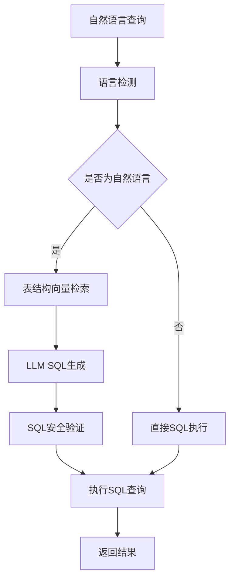

# NLP到SQL转换功能说明

## 功能概述

该功能将自然语言查询自动转换为SQL语句，支持中英文查询，基于向量检索技术智能匹配相关表结构，使用大语言模型生成准确的SQL查询。

## 架构设计

### 核心组件



### 主要类说明

1. **DatabaseTableSchema**: 表结构数据模型
   - 存储表的元数据信息（表名、字段、索引、外键等）
   - 支持中英文描述和业务含义
   - 提供向量化文本生成方法

2. **TableSchemaVectorizationService**: 表结构向量化服务
   - 将数据库表结构转换为向量并存储
   - 支持增量更新和缓存管理
   - 自动提取数据库元数据

3. **SchemaRetrievalService**: 向量检索服务
   - 根据自然语言查询检索相关表结构
   - 支持相似度阈值和结果数量控制
   - 提供表关系分析功能

4. **NlpToSqlService**: NLP到SQL转换服务
   - 自然语言识别和SQL生成
   - 安全验证和置信度评估
   - 支持复杂查询和多表关联

5. **SqlQueryContentRetriever**: 增强的SQL查询检索器
   - 智能识别输入类型（SQL vs 自然语言）
   - 集成NLP到SQL转换流程
   - 保持向后兼容性

## 使用方式

### 1. 配置启用

在 `application.yaml` 中配置：

```yaml
smartcs:
  nlp2sql:
    # 功能总开关
    enable-nlp-mode: true
    # 最小置信度阈值
    min-confidence: 0.6
    # 表结构相似度阈值
    similarity-threshold: 0.6
    # 最大使用表数量
    max-tables-for-sql: 5
    # 是否允许复杂查询
    enable-complex-queries: true
    
    # 模型配置
    chat-model-id: 1
    embedding-model-id: 1
```

### 2. 初始化表结构向量化

首次使用需要向量化数据库表结构：

```java
@Autowired
private TableSchemaVectorizationService vectorizationService;

// 向量化所有表结构
vectorizationService.vectorizeAllTableSchemas()
    .thenAccept(count -> log.info("向量化完成，处理了{}个表", count));

// 或单独更新某个表
vectorizationService.updateTableSchema("t_cs_user");
```

### 3. 使用NLP查询

#### 方式一：通过ContentRetriever（推荐）

```java
@Autowired
private SqlQueryContentRetriever sqlRetriever;

// 自然语言查询
Query nlpQuery = Query.from("查询所有活跃用户的信息");
List<Content> results = sqlRetriever.retrieve(nlpQuery);

// SQL查询（兼容原有功能）
Query sqlQuery = Query.from("SELECT * FROM t_cs_user WHERE status = 'ACTIVE'");
List<Content> results2 = sqlRetriever.retrieve(sqlQuery);
```

#### 方式二：直接使用NLP服务

```java
@Autowired
private NlpToSqlService nlpToSqlService;

// 生成SQL
SqlGenerationResult result = nlpToSqlService.generateSql("查询销售额最高的产品");

if (result.getSuccess()) {
    String sql = result.getGeneratedSql();
    double confidence = result.getConfidence();
    List<String> usedTables = result.getUsedTables();
    
    if (result.isHighConfidence()) {
        // 高置信度，可直接执行
        executeSQL(sql);
    } else {
        // 低置信度，建议人工确认
        confirmBeforeExecution(sql);
    }
}
```

### 4. 查询示例

支持的自然语言查询类型：

```java
// 基础查询
"查询所有用户信息"
"显示用户表的所有记录"
"show all users"

// 条件查询
"查询状态为活跃的用户"
"找出最近注册的用户"
"显示价格大于100的产品"

// 统计查询
"统计用户总数"
"计算平均销售额"
"查询每个分类的产品数量"

// 排序查询
"按注册时间降序显示用户"
"查询销售额最高的10个产品"

// 多表关联
"查询用户的会话记录"
"显示知识库中的文档列表"
"统计每个用户的消息数量"
```

## 功能特性

### 1. 智能语言识别

- 自动识别输入是SQL语句还是自然语言
- 支持中英文混合查询
- 兼容现有SQL查询方式

### 2. 向量检索匹配

- 基于语义相似度匹配相关表结构
- 支持表名、字段名、业务描述的全文匹配
- 可配置相似度阈值和结果数量

### 3. 智能SQL生成

- 使用LangChain4j集成的大语言模型
- 基于检索到的表结构生成准确SQL
- 支持JOIN查询和复杂条件

### 4. 安全保护机制

- 严格限制只能生成SELECT语句
- 危险关键词黑名单检查
- SQL注入防护

### 5. 置信度评估

- 基于多维度计算置信度分数
- 低置信度结果会提醒用户确认
- 支持自定义置信度阈值

### 6. 可观测性

- 完整的日志记录和指标收集
- 支持调试模式查看详细过程
- 错误处理和降级策略

## 配置说明

### 核心配置项

| 配置项 | 默认值 | 说明 |
|--------|--------|------|
| enable-nlp-mode | true | 功能总开关 |
| min-confidence | 0.6 | 最小置信度阈值 |
| similarity-threshold | 0.6 | 表结构相似度阈值 |
| max-tables-for-sql | 5 | SQL生成最大使用表数 |
| enable-complex-queries | true | 是否允许复杂查询 |
| chat-model-id | 1 | SQL生成使用的聊天模型ID |
| embedding-model-id | 1 | 向量化使用的嵌入模型ID |

### 向量存储配置

```yaml
smartcs:
  nlp2sql:
    schema-index-prefix: "table_schema:"  # 向量索引前缀
    schema-search-max-results: 10         # 最大搜索结果数
```

### 提示模板配置

```yaml
smartcs:
  nlp2sql:
    prompt-template:
      system-message: "你是一个专业的SQL生成助手"
      include-table-relationships: true    # 包含表关系信息
      include-column-descriptions: true    # 包含字段描述
      include-business-context: true       # 包含业务上下文
```

## 调试和测试

### 1. 启用演示模式

```bash
java -jar smartcs-web.jar --demo.nlp2sql.enabled=true
```

演示模式会自动：
- 向量化数据库表结构
- 测试多种自然语言查询
- 输出详细的转换过程和结果

### 2. 查看调试信息

设置日志级别为DEBUG：

```yaml
logging:
  level:
    com.leyue.smartcs.rag.database: DEBUG
```

### 3. 单元测试

```bash
# 运行NLP到SQL服务测试
mvn test -Dtest=NlpToSqlServiceTest

# 运行所有相关测试
mvn test -Dtest=*NlpToSql*
```

## 性能优化

### 1. 向量缓存

- 表结构向量会自动缓存在内存中
- 支持增量更新，避免重复向量化
- 建议在应用启动时预加载热点表结构

### 2. 查询优化

- 设置合理的相似度阈值，平衡准确性和性能
- 限制最大使用表数量，避免生成过于复杂的SQL
- 使用异步处理提高响应速度

### 3. 成本控制

- 设置Token消费预算上限
- 缓存常用查询的转换结果
- 在低置信度时提供快速降级选项

## 故障排除

### 常见问题

1. **表结构向量化失败**
   - 检查数据库连接配置
   - 确认embedding模型可用
   - 查看表结构权限

2. **自然语言识别不准确**
   - 调整语言检测模式
   - 使用更明确的关键词
   - 检查输入编码问题

3. **SQL生成质量差**
   - 降低相似度阈值获取更多表信息
   - 完善表和字段的中文描述
   - 优化提示模板

4. **置信度过低**
   - 调低min-confidence阈值
   - 提供更详细的表业务描述
   - 使用更强的语言模型

### 监控指标

- SQL生成成功率
- 平均置信度分数
- 查询响应时间
- Token消费量
- 错误类型分布

## 扩展开发

### 1. 添加新的数据源

实现`TableSchemaVectorizationService`的扩展：

```java
@Service
public class CustomSchemaVectorizationService extends TableSchemaVectorizationService {
    // 自定义表结构提取逻辑
}
```

### 2. 自定义SQL生成策略

继承`NlpToSqlService`并重写相关方法：

```java
@Service  
public class EnhancedNlpToSqlService extends NlpToSqlService {
    @Override
    protected String buildSqlGenerationPrompt(String nlpQuery, SchemaRetrievalResult schemaResult) {
        // 自定义提示构建逻辑
    }
}
```

### 3. 添加新的安全检查

扩展安全验证逻辑：

```java
private SecurityValidationResult customSecurityValidation(String sql) {
    // 自定义安全检查
}
```

## 版本历史

- v1.0.0: 初始版本，支持基础NLP到SQL转换
- v1.1.0: 增加置信度评估和安全验证
- v1.2.0: 优化提示模板和错误处理

## 相关文档

- [LangChain4j集成文档](./LANGCHAIN4J_INTEGRATION.md)
- [向量数据库配置指南](./VECTOR_STORE_CONFIG.md)
- [SQL安全最佳实践](./SQL_SECURITY_GUIDE.md)